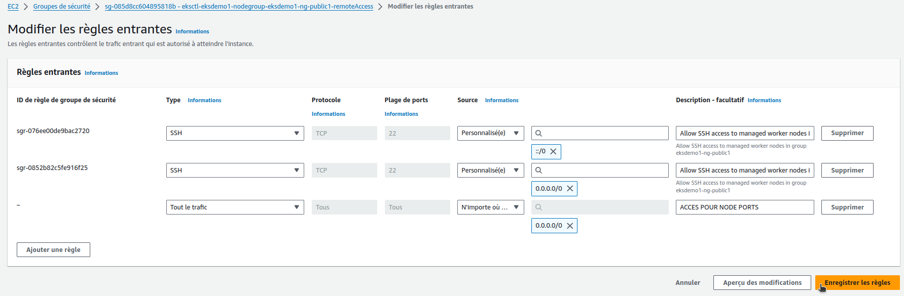

# Create EKS Cluster & Node Groups

## Step-00: Introduction
- Understand about EKS Core Objects
  - Control Plane
  - Worker Nodes & Node Groups
  - Fargate Profiles
  - VPC


- Create EKS Cluster
- Associate EKS Cluster to IAM OIDC Provider
- Create EKS Node Groups
- Verify Cluster, Node Groups, EC2 Instances, IAM Policies and Node Groups

## Step-01: Create EKS Cluster using eksctl
- It will take 15 to 20 minutes to create the Cluster Control Plane 
```t


# Create Cluster
$ eksctl create cluster --name=eksdemo1 \
                      --region=eu-west-3 \
                      --zones=eu-west-3a,eu-west-3b \
                      --without-nodegroup 
...
2024-10-22 13:33:04 [ℹ]  kubectl command should work with "/home/vincent/.kube/config", try 'kubectl get nodes'
2024-10-22 13:33:04 [✔]  EKS cluster "eksdemo1" in "eu-west-3" region is ready
```
**eksctl create cluster** : C'est une commande de l'outil eksctl qui permet de créer un cluster EKS sur AWS. eksctl est un outil en ligne de commande pour la création et la gestion des clusters EKS, qui simplifie les configurations complexes en fournissant des commandes intuitives.

**--name=eksdemo1** : Spécifie le nom du cluster EKS à créer. Ici, le cluster sera nommé eksdemo1. Ce nom est utilisé pour référencer le cluster dans d'autres commandes et configurations.

**--region=eu-west-3** : Spécifie la région AWS dans laquelle le cluster EKS sera créé. Dans cet exemple, la région choisie est eu-west-3, qui correspond à la région AWS de Paris.

**--zones=eu-west-3a,eu-west-3b** : Indique les zones de disponibilité (Availability Zones) dans lesquelles le cluster EKS déploiera ses ressources.
Ici, le cluster utilisera les zones eu-west-3a et eu-west-3b pour distribuer les ressources. Cela offre une meilleure résilience et disponibilité des applications.

**--without-nodegroup** : Cette option indique de ne pas créer de groupe de nœuds par défaut lors de la création du cluster.
Cela signifie que le cluster EKS sera créé avec son plan de contrôle (Control Plane) uniquement, sans les nœuds de calcul (instances EC2) associés.

Cette option est utile si on souhaite gérer les groupes de nœuds séparément ou si on a des exigences particulières pour la configuration des nœuds (par exemple, des types d'instances spécifiques ou des configurations réseau personnalisées).

En plus de créer le cluster, elle met à jour le fichier ~/.kube/config

```t
# Get List of clusters
$ eksctl get cluster  
NAME            REGION          EKSCTL CREATED
eksdemo1        eu-west-3       True              
```
On peut voir le VPC, l'Internet gateway et la NAT Gateway (nécessaire aux instances dans le reseau privé pour accès à l'API privée du Controle Plane de l'EKS) de crées dans le VPC dédié :


Cela créé une stack dans CloudFormation :


Et on peut voir les évenements liés à la stack :


## Step-02: Create & Associate IAM OIDC Provider for our EKS Cluster
- To enable and use AWS IAM roles for Kubernetes service accounts on our EKS cluster, we must create &  associate OIDC identity provider.
- To do so using `eksctl` we can use the  below command. 
- Use latest eksctl version (as on today the latest version is `0.21.0`)
- Si un fournisseur d'identité OIDC existait déjà, il en crée un autre.

```t     
# Template
$ eksctl utils associate-iam-oidc-provider \
    --region region-code \
    --cluster <cluter-name> \
    --approve

# Replace with region & cluster name
$ eksctl utils associate-iam-oidc-provider \
    --region eu-west-3 \
    --cluster eksdemo1 \
    --approve
2024-10-22 13:35:44 [ℹ]  will create IAM Open ID Connect provider for cluster "eksdemo1" in "eu-west-3"
2024-10-22 13:35:44 [✔]  created IAM Open ID Connect provider for cluster "eksdemo1" in "eu-west-3"
```

On peut voir l'OIDC :


Et le lien avec le cluster crée :


### Explications des options

**eksctl utils associate-iam-oidc-provider** : C'est une commande de l'outil eksctl utilisée pour associer un fournisseur OIDC (OpenID Connect) à un cluster EKS. Cette association permet au cluster EKS d'utiliser IRSA (IAM Roles for Service Accounts), une fonctionnalité qui permet de lier des rôles IAM aux comptes de service Kubernetes. Cela facilite l’attribution de permissions AWS aux pods de Kubernetes de manière sécurisée et granulaire. Cela nous servira plus tard pour pour accèder à Route53, création de Load Balancer, accès aux S3 via des rôles.

**--region eu-west-3** : Indique la région AWS où se trouve le cluster EKS. Ici, la région spécifiée est eu-west-3, qui correspond à la région AWS de Paris.

**--cluster eksdemo1** : Spécifie le nom du cluster EKS auquel le fournisseur OIDC doit être associé. Dans cet exemple, le cluster est nommé eksdemo1. Cette commande recherche ce cluster et prépare l'association du fournisseur OIDC.

**--approve** : Cette option approuve automatiquement l'association du fournisseur OIDC sans demander de confirmation supplémentaire. Cela permet d'exécuter la commande de manière non interactive. Sans cette option, eksctl demanderait une confirmation manuelle pour finaliser l'association.

#### Pourquoi utiliser cette commande ?

Lorsque tu associes un fournisseur OIDC à un cluster EKS, cela permet au cluster de créer des rôles IAM et de les associer à des comptes de service Kubernetes via des annotations. Cela active IRSA, une fonctionnalité qui offre un contrôle précis des permissions au niveau des pods. Grâce à OIDC et IRSA, les pods peuvent assumer un rôle IAM spécifique pour accéder aux ressources AWS de manière sécurisée et fine, sans avoir à gérer des clés d'accès longues.

Cette commande associe un fournisseur OIDC à un cluster EKS nommé eksdemo1 dans la région eu-west-3. Cette association permet d'utiliser IRSA, facilitant l'attribution de permissions AWS aux pods Kubernetes via des rôles IAM. L'option --approve permet de confirmer l'association sans intervention manuelle.


## Step-03: Create EC2 Keypair
- Create a new EC2 Keypair with name as `kube-demo`
- This keypair we will use it when creating the EKS NodeGroup.
- This will help us to login to the EKS Worker Nodes using Terminal.
- A mettre dans ~/Téléchargement

## Step-04: Create Node Group with additional Add-Ons in Public Subnets
- These add-ons will create the respective IAM policies for us automatically within our Node Group role.
 ```t
# Les flags de l'aide de eksctl create nodegroup
$ eksctl create nodegroup --help
Create a nodegroup
..
Addons flags:
      --asg-access                  enable IAM policy for cluster-autoscaler
      --external-dns-access         enable IAM policy for external-dns
      --full-ecr-access             enable full access to ECR
      --appmesh-access              enable full access to AppMesh
      --appmesh-preview-access      enable full access to AppMesh Preview
      --alb-ingress-access          enable full access for alb-ingress-controller
      --install-neuron-plugin       install Neuron plugin for Inferentia and Trainium nodes (default true)
      --install-nvidia-plugin       install Nvidia plugin for GPU nodes (default true)
      --nodegroup-parallelism int   Number of self-managed or managed nodegroups to create in parallel (default 8)
...

# Create Public Node Group   
eksctl create nodegroup --cluster=eksdemo1 \
                        --region=eu-west-3 \
                        --name=eksdemo1-ng-public1 \
                        --node-type=t3.medium \
                        --nodes=2 \
                        --nodes-min=2 \
                        --nodes-max=4 \
                        --node-volume-size=20 \
                        --ssh-access \
                        --ssh-public-key=kube-demo \
                        --managed \
                        --asg-access \
                        --external-dns-access \
                        --full-ecr-access \
                        --appmesh-access \
                        --alb-ingress-access 
                        
...
2024-10-22 13:39:59 [✔]  created 1 managed nodegroup(s) in cluster "eksdemo1"
2024-10-22 13:39:59 [ℹ]  checking security group configuration for all nodegroups
2024-10-22 13:39:59 [ℹ]  all nodegroups have up-to-date cloudformation templates
```

Explications détaillées des options :
**eksctl create nodegroup** :C'est une commande de eksctl (outil en ligne de commande pour gérer des clusters EKS) utilisée pour créer un groupe de nœuds (node group) dans un cluster EKS existant.

**--cluster=eksdemo1** : Spécifie le nom du cluster EKS auquel ce groupe de nœuds doit être ajouté. Ici, le nom du cluster est eksdemo1.

**--region=eu-west-3** : Spécifie la région AWS où se trouve le cluster. Dans cet exemple, la région est eu-west-3 (Paris).

**--name=eksdemo1-ng-public1** : Donne un nom au groupe de nœuds. Ici, le groupe de nœuds est nommé eksdemo1-ng-public1.

**--node-type=t3.medium** : Définit le type d'instances EC2 à utiliser pour les nœuds. Ici, le type choisi est t3.medium, qui offre un bon équilibre entre coût et performance.

**--nodes=2** : Définit le nombre souhaité de nœuds dans le groupe. Ici, 2 nœuds seront créés par défaut.

**--nodes-min=2** : Définit le nombre minimum de nœuds dans le groupe. Il ne sera jamais réduit en dessous de 2 nœuds.

**--nodes-max=4** : Définit le nombre maximum de nœuds dans le groupe. Le groupe de nœuds peut évoluer jusqu'à 4 nœuds si nécessaire.

**--node-volume-size=20** : Définit la taille du volume EBS (en Go) attaché à chaque instance EC2 pour le stockage. Ici, chaque nœud aura un volume de 20 Go.

**--ssh-access** : Permet l'accès SSH aux nœuds. Cette option active l'accès SSH, ce qui est utile pour la maintenance et les diagnostics.

**--ssh-public-key=kube-demo** : Spécifie le nom de la clé SSH publique qui doit être utilisée pour accéder aux nœuds. La clé publique doit être déjà créée et présente dans AWS EC2. Ici, la clé est nommée kube-demo.

**--managed** : Indique que le groupe de nœuds sera géré par EKS. Les groupes de nœuds gérés simplifient la gestion des mises à jour et la maintenance.

**--asg-access** : Donne à EKS les permissions pour gérer l'Auto Scaling Group (ASG) associé au groupe de nœuds. Cela permet d'ajuster le nombre de nœuds en fonction de la charge de travail.

**--external-dns-access** : Donne au groupe de nœuds l'accès pour gérer les enregistrements DNS externes à l'aide d'un service comme ExternalDNS, qui crée et gère des enregistrements DNS basés sur des annotations Kubernetes.

**--full-ecr-access** : Donne un accès complet au registre de conteneurs ECR d'AWS. Cela permet aux nœuds de tirer des images de conteneur depuis ECR sans problème d'autorisation.

**--appmesh-access** : Donne au groupe de nœuds l'accès à AWS App Mesh, un service de maillage de services qui facilite la communication entre les microservices.

**--alb-ingress-access** : Donne au groupe de nœuds l'accès à AWS ALB Ingress Controller, qui gère l'équilibrage de charge de manière dynamique avec des ALB (Application Load Balancer).

Cela ajoute une nouvelle stack concernant les Nodes Groups dans CloudFormation :


## Step-05: Verify Cluster & Nodes

### Verify NodeGroup subnets to confirm EC2 Instances are in Public Subnet
- Verify the node group subnet to ensure it created in public subnets
  - Go to Services -> EKS -> eksdemo -> eksdemo1-ng1-public
  - Click on Associated subnet in **Details** tab
  - Click on **Route Table** Tab.
  - We should see that internet route via Internet Gateway (0.0.0.0/0 -> igw-xxxxxxxx)

### Verify Cluster, NodeGroup in EKS Management Console
- Go to Services -> Elastic Kubernetes Service -> eksdemo1

### List Worker Nodes
```t
# List EKS clusters
$ eksctl get cluster
NAME            REGION          EKSCTL CREATED
eksdemo1        eu-west-3       True

# List NodeGroups in a cluster
$ eksctl get nodegroup --cluster=<clusterName>

$ eksctl get nodegroup --cluster=eksdemo1
CLUSTER         NODEGROUP               STATUS  CREATED                 MIN SIZE        MAX SIZE        DESIRED CAPACITY        INSTANCE TYPE   IMAGE ID        ASG NAME      TYPE
eksdemo1        eksdemo1-ng-public1     ACTIVE  2024-10-22T11:37:13Z    2               4               2                       t3.medium       AL2_x86_64      eks-eksdemo1-ng-public1-5ec95a02-21fb-9b03-c996-2ab1498e0a94   managed

# List Nodes in current kubernetes cluster
$ kubectl get nodes -o wide
NAME                                           STATUS   ROLES    AGE   VERSION               INTERNAL-IP      EXTERNAL-IP      OS-IMAGE         KERNEL-VERSION                  CONTAINER-RUNTIME
ip-192-168-10-171.eu-west-3.compute.internal   Ready    <none>   58m   v1.30.4-eks-a737599   192.168.10.171   15.237.126.163   Amazon Linux 2   5.10.226-214.879.amzn2.x86_64   containerd://1.7.22
ip-192-168-54-184.eu-west-3.compute.internal   Ready    <none>   58m   v1.30.4-eks-a737599   192.168.54.184   35.180.68.231    Amazon Linux 2   5.10.226-214.879.amzn2.x86_64   containerd://1.7.22

# Our kubectl context should be automatically changed to new cluster
kubectl config view --minify
apiVersion: v1
clusters:
- cluster:
    certificate-authority-data: DATA+OMITTED
    server: https://308XXXXXXXXXXXXXXXXXXXXXX8.gr7.eu-west-3.eks.amazonaws.com
  name: eksdemo1.eu-west-3.eksctl.io
contexts:
- context:
    cluster: eksdemo1.eu-west-3.eksctl.io
    user: vincent@eksdemo1.eu-west-3.eksctl.io
  name: vincent@eksdemo1.eu-west-3.eksctl.io
current-context: vincent@eksdemo1.eu-west-3.eksctl.io
kind: Config
preferences: {}
users:
- name: vincent@eksdemo1.eu-west-3.eksctl.io
  user:
    exec:
      apiVersion: client.authentication.k8s.io/v1beta1
      args:
      - eks
      - get-token
      - --output
      - json
      - --cluster-name
      - eksdemo1
      - --region
      - eu-west-3
      command: aws
      env:
      - name: AWS_STS_REGIONAL_ENDPOINTS
        value: regional
      interactiveMode: IfAvailable
      provideClusterInfo: false
```

### Verify Worker Node IAM Role and list of Policies
- Go to Services -> EC2 -> Worker Nodes
- Click on **IAM Role associated to EC2 Worker Nodes**


Ou avec aws cli :

```t
# Obtenir le profil d’instance attaché
$ aws ec2 describe-instances --instance-ids i-0583633540896fea5 --query "Reservations[*].Instances[*].IamInstanceProfile.Arn" --output text
arn:aws:iam::851725523446:instance-profile/eks-5ec95a02-21fb-9b03-c996-2ab1498e0a94

# Obtenir le rôle associé au profil IAM
$ aws iam get-instance-profile --instance-profile-name eks-5ec95a02-21fb-9b03-c996-2ab1498e0a94
{
    "InstanceProfile": {
        "Path": "/",
        "InstanceProfileName": "eks-5ec95a02-21fb-9b03-c996-2ab1498e0a94",
        "InstanceProfileId": "AIPA4MTWMDH3NTSQEQ6M7",
        "Arn": "arn:aws:iam::851725523446:instance-profile/eks-5ec95a02-21fb-9b03-c996-2ab1498e0a94",
        "CreateDate": "2024-10-22T11:37:15+00:00",
        "Roles": [
            {
                "Path": "/",
                "RoleName": "eksctl-eksdemo1-nodegroup-eksdemo1-NodeInstanceRole-VdJRDmhl8ue2", <------ ICI
                "RoleId": "AROA4MTWMDH3LHILDHTI2",
                "Arn": "arn:aws:iam::851725523446:role/eksctl-eksdemo1-nodegroup-eksdemo1-NodeInstanceRole-VdJRDmhl8ue2",
                "CreateDate": "2024-10-22T11:36:52+00:00",
                "AssumeRolePolicyDocument": {
                    "Version": "2012-10-17",
                    "Statement": [
                        {
                            "Effect": "Allow",
                            "Principal": {
                                "Service": "ec2.amazonaws.com"
                            },
                            "Action": "sts:AssumeRole"
                        }
                    ]
                }
            }
        ],
        "Tags": []
    }
}

# Lister les politiques gérées du rôle
$ aws iam list-attached-role-policies --role-name eksctl-eksdemo1-nodegroup-eksdemo1-NodeInstanceRole-VdJRDmhl8ue2
{
    "AttachedPolicies": [
        {
            "PolicyName": "AmazonEC2ContainerRegistryPowerUser",
            "PolicyArn": "arn:aws:iam::aws:policy/AmazonEC2ContainerRegistryPowerUser"
        },
        {
            "PolicyName": "AmazonSSMManagedInstanceCore",
            "PolicyArn": "arn:aws:iam::aws:policy/AmazonSSMManagedInstanceCore"
        },
        {
            "PolicyName": "AmazonEKS_CNI_Policy",
            "PolicyArn": "arn:aws:iam::aws:policy/AmazonEKS_CNI_Policy"
        },
        {
            "PolicyName": "AmazonEC2ContainerRegistryReadOnly",
            "PolicyArn": "arn:aws:iam::aws:policy/AmazonEC2ContainerRegistryReadOnly"
        },
        {
            "PolicyName": "AmazonEKSWorkerNodePolicy",
            "PolicyArn": "arn:aws:iam::aws:policy/AmazonEKSWorkerNodePolicy"
        }
    ]
}

# Lister les politiques en ligne du rôle 
$ aws iam list-role-policies --role-name eksctl-eksdemo1-nodegroup-eksdemo1-NodeInstanceRo
le-VdJRDmhl8ue2
{
    "PolicyNames": [
        "eksctl-eksdemo1-nodegroup-eksdemo1-ng-public1-PolicyAppMesh",
        "eksctl-eksdemo1-nodegroup-eksdemo1-ng-public1-PolicyAutoScaling",
        "eksctl-eksdemo1-nodegroup-eksdemo1-ng-public1-PolicyAWSLoadBalancerController",
        "eksctl-eksdemo1-nodegroup-eksdemo1-ng-public1-PolicyExternalDNSChangeSet",
        "eksctl-eksdemo1-nodegroup-eksdemo1-ng-public1-PolicyExternalDNSHostedZones"
    ]
}

# Obtenir les détails d'une politique (facultatif) :
$ aws iam get-policy --policy-arn <ARN-de-la-policy>
$ aws iam get-policy-version --policy-arn <ARN-de-la-policy> --version-id v1

```


### Verify CloudFormation Stacks
- Verify Control Plane Stack & Events
- Verify NodeGroup Stack & Events


On peut entrer dedans pour voir les évènements, etc.


### Verify Security Group Associated to Worker Nodes
- Go to Services -> EC2 -> Worker Nodes
- Click on **Security Group** associated to EC2 Instance which contains `remote` in the name.

On peut voir les 2 groupes de sécurité (on va s'interesser au remoteAccess)


### Login to Worker Node using Keypai kube-demo
- Login to worker node
```
# For MAC or Linux or Windows10
ssh -i kube-demo.pem ec2-user@<Public-IP-of-Worker-Node>

# For Windows 7
Use putty
```

## Step-06: Update Worker Nodes Security Group to allow all traffic
- We need to allow `All Traffic` on worker node security group RemoteAccess 



## Additional References
- https://docs.aws.amazon.com/eks/latest/userguide/enable-iam-roles-for-service-accounts.html
- https://docs.aws.amazon.com/eks/latest/userguide/create-service-account-iam-policy-and-role.html

# A VERIFIER A LA PROCHAINE CREATION

On a une classe storage déjà de crée par eksctl :

```t
$ kubectl get sc
NAME   PROVISIONER             RECLAIMPOLICY   VOLUMEBINDINGMODE      ALLOWVOLUMEEXPANSION   AGE
gp2    kubernetes.io/aws-ebs   Delete          WaitForFirstConsumer   false                  140m
```