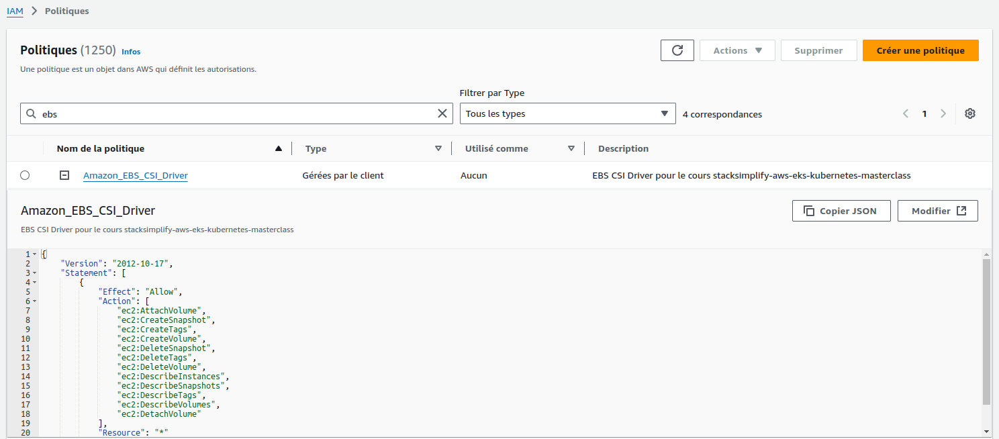
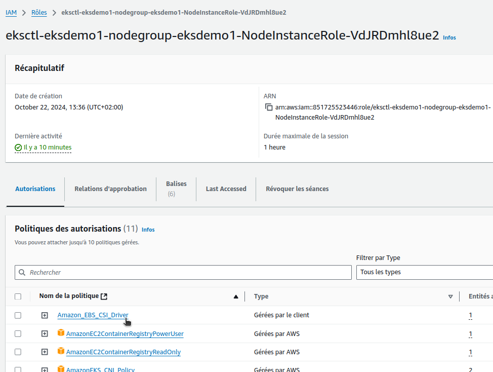

# EKS Storage with EBS - Elastic Block Store

## Step-01: Introduction
- Create IAM Policy for EBS
- Associate IAM Policy to Worker Node IAM Role
- Install EBS CSI Driver

## Step-02:  Create IAM policyy
- Go to Services -> IAM
- Create a Policy 
  - Select JSON tab and copy paste the below JSON
```json

{
  "Version": "2012-10-17",
  "Statement": [
    {
      "Effect": "Allow",
      "Action": [
        "ec2:AttachVolume",
        "ec2:CreateSnapshot",
        "ec2:CreateTags",
        "ec2:CreateVolume",
        "ec2:DeleteSnapshot",
        "ec2:DeleteTags",
        "ec2:DeleteVolume",
        "ec2:DescribeInstances",
        "ec2:DescribeSnapshots",
        "ec2:DescribeTags",
        "ec2:DescribeVolumes",
        "ec2:DetachVolume"
      ],
      "Resource": "*"
    }
  ]
}
```
Cette politique IAM accorde la permission "Allow" à effectuer diverses actions EC2, telles que attacher, créer, supprimer et décrire des volumes et des snapshots, ainsi que créer et supprimer des balises sur ces ressources. Les actions sont autorisées pour toutes les ressources EC2 (indiquées par "Resource": "*"), ce qui signifie que cette politique donne un accès complet à ces opérations sur tous les volumes, snapshots, instances, et balises EC2 dans le compte AWS.


  - Review the same in **Visual Editor** 
  - Click on **Review Policy**
  - **Name:** Amazon_EBS_CSI_Driver
  - **Description:** Policy for EC2 Instances to access Elastic Block Store
  - Click on **Create Policy**




## Step-03: Get the IAM role Worker Nodes using and Associate this policy to that role
```t
# Get Worker node IAM Role ARN
kubectl -n kube-system describe configmap aws-auth
Name:         aws-auth
Namespace:    kube-system
Labels:       <none>
Annotations:  <none>

Data
====
mapRoles:
----
- groups:
  - system:bootstrappers
  - system:nodes
  rolearn: arn:aws:iam::851725523446:role/eksctl-eksdemo1-nodegroup-eksdemo1-NodeInstanceRole-VdJRDmhl8ue2  <------ ICI
  username: system:node:{{EC2PrivateDNSName}}


BinaryData
====

Events:  <none>


# from output check rolearn
rolearn: arn:aws:iam::851725523446:role/eksctl-eksdemo1-nodegroup-eksdemo1-NodeInstanceRole-VdJRDmhl8ue2
```

- Go to Services -> IAM -> Roles 
- Search for role with name **eksctl-eksdemo1-nodegroup** and open it


- Click on **Permissions** tab
- Click on **Attach Policies**
- Search for **Amazon_EBS_CSI_Driver** and click on **Attach Policy**


En ligne de commandes :

```t
$ aws eks describe-nodegroup --cluster-name eksdemo1 --nodegroup-name eksdemo1-ng-public1 --query "nodegroup.nodeRole" --output text
arn:aws:iam::851725523446:role/eksctl-eksdemo1-nodegroup-eksdemo1-NodeInstanceRole-VdJRDmhl8ue2

# Ou avec une extraction  
$ aws eks describe-nodegroup --cluster-name eksdemo1 --nodegroup-name eksdemo1-ng-public1 --query "nodegroup.nodeRole" --output text | awk -F'/' '{print $2}'
eksctl-eksdemo1-nodegroup-eksdemo1-NodeInstanceRole-VdJRDmhl8ue2

# Recupération de l'ARN de la policy Amazon_EBS_CSI_Driver
$ aws iam list-policies --query "Policies[?PolicyName=='Amazon_EBS_CSI_Driver'].[PolicyName,Arn]" --output text
Amazon_EBS_CSI_Driver   arn:aws:iam::851725523446:policy/Amazon_EBS_CSI_Driver

$ aws iam attach-role-policy --role-name eksctl-eksdemo1-nodegroup-eksdemo1-NodeInstanceRole-VdJRDmhl8ue2 --policy-arn arn:aws:iam::851725523446:policy/Amazon_EBS_CSI_Driver
```

On peut voir dans la console que Amazon_EBS_CSI_Driver est bien attaché au rôle  eksctl-eksdemo1-nodegroup-eksdemo1-NodeInstanceRole-xxxx





## Step-04: Deploy Amazon EBS CSI Driver  
- Verify kubectl version, it should be 1.14 or later
```
kubectl version --client --short
```
- Deploy Amazon EBS CSI Driver
```
# Deploy EBS CSI Driver
kubectl apply -k "github.com/kubernetes-sigs/aws-ebs-csi-driver/deploy/kubernetes/overlays/stable/?ref=master"

# Verify ebs-csi pods running
kubectl get pods -n kube-system
```
