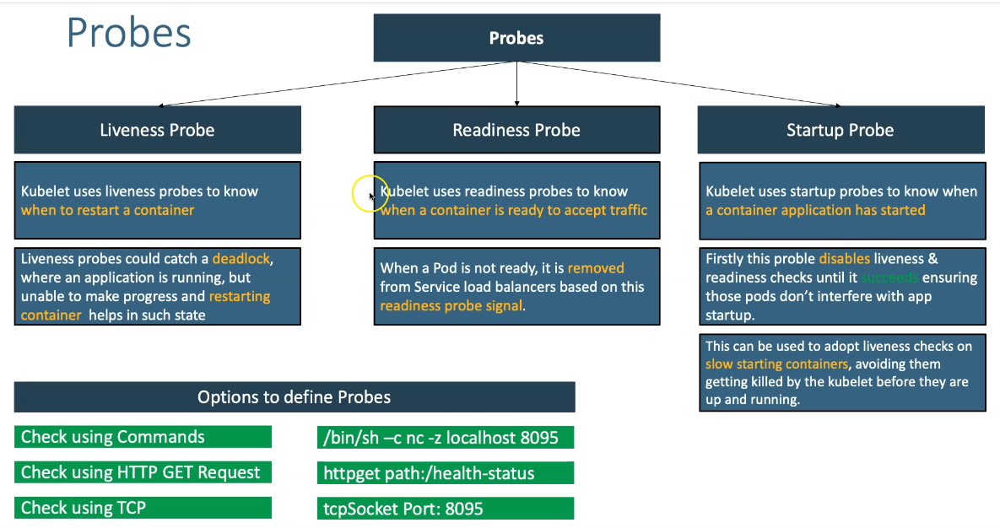

# Kubernetes - Liveness & Readiness Probes

## Step-01: Introduction
- Refer `Probes` slide for additional details



Quand un container est trop long à démarrer, il peut être tué et relancé par le controleur et comme ce sera pareil pour le prochain lancé, on se retrouve dans un deadlock et le container ne demarre jamais. Pour éviter cela, on va se servir de **readinessProbe** 


## Step-02: Create Liveness Probe with Command
```yml
          livenessProbe:
            exec:
              command:
                - /bin/sh
                - -c
                - nc -z localhost 8095
            initialDelaySeconds: 60
            periodSeconds: 10
```

## Step-03: Create Readiness Probe with HTTP GET
```yml
          readinessProbe:
            httpGet:
              path: /usermgmt/health-status
              port: 8095
            initialDelaySeconds: 60
            periodSeconds: 10     
```

## Step-04: Create k8s objects & Test
```
# Create All Objects
kubectl apply -f kube-manifests/

# List Pods
kubectl get pods

# Watch List Pods screen
$ kubectl get pods -w
NAME                                    READY   STATUS              RESTARTS   AGE
mysql-64864d79c7-qmk56                  0/1     ContainerCreating   0          5s
usermgmt-microservice-fc67b4fbc-j58kw   0/1     Init:0/1            0          5s
mysql-64864d79c7-qmk56                  1/1     Running             0          9s
usermgmt-microservice-fc67b4fbc-j58kw   0/1     PodInitializing     0          20s
usermgmt-microservice-fc67b4fbc-j58kw   0/1     Running             0          21s

# Describe Pod & Discuss about init container
kubectl describe pod <usermgmt-microservice-xxxxxx>

# Access Application Health Status Page
http://<WorkerNode-Public-IP>:31231/usermgmt/health-status
```
- **Observation:** User Management Microservice pod witll not be in READY state to accept traffic until it completes the `initialDelaySeconds=60seconds`. 

## Step-05: Clean-Up
- Delete all k8s objects created as part of this section
```
# Delete All
kubectl delete -f kube-manifests/

# List Pods
kubectl get pods

# Verify sc, pvc, pv
kubectl get sc,pvc,pv
```


## References:
- https://kubernetes.io/docs/tasks/configure-pod-container/configure-liveness-readiness-startup-probes/
