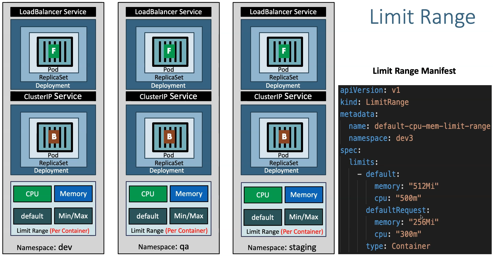

# Kubernetes Namespaces - LimitRange - Declarative using YAML



## Step-01: Create Namespace manifest

- **Important Note:** File name starts with `00-`  so that when creating k8s objects namespace will get created first so it don't throw an error.

```yml
apiVersion: v1 
kind: Namespace  # Spécifie le type de ressource Kubernetes, ici un Namespace.
metadata: 
  name: dev3  # Le nom du namespace à créer, ici 'dev3'. Utilisé pour organiser les ressources au sein d'un cluster.
```

## Step-02: Create LimitRange manifest
- Instead of specifying `resources like cpu and memory` in every container spec of a pod defintion, we can provide the default CPU & Memory for all containers in a namespace using `LimitRange`

```yml
apiVersion: v1 
kind: LimitRange  # Spécifie le type de ressource Kubernetes, ici un LimitRange.
metadata:
  name: default-cpu-mem-limit-range  # Nom de cette configuration de limites, ici 'default-cpu-mem-limit-range'.
  namespace: dev3  # Associe cette ressource au namespace 'dev3'.
spec:
  limits:
    - default:
        cpu: "500m"  # Limite de CPU par défaut. Si non spécifié, la limite par défaut est de 1 vCPU par conteneur.
        memory: "512Mi"  # Limite de mémoire par défaut. Si non spécifié, chaque conteneur est limité à 512Mi de mémoire.
      defaultRequest:
        cpu: "300m"  # Demande de CPU par défaut, ici 300m (soit 0,3 vCPU). Si aucune demande n'est spécifiée pour un conteneur.
        memory: "256Mi"  # Demande de mémoire par défaut, ici 256Mi. Utilisé si aucun conteneur ne spécifie de demande.
      type: Container  # Spécifie que ces limites s'appliquent au niveau des conteneurs.
```

## Step-03: Update all k8s manifest with namespace
- Update all files from 02 to 08 with `namespace: dev3` in top metadata section in folder `kube-manifests/02-Declarative` 
- **Example**
```yml
apiVersion: v1
kind: PersistentVolumeClaim
metadata:
  name: ebs-mysql-pv-claim
  namespace: dev3
```

Note : Le _StorageClass_ n'est pas dépendant d'un NameSpace, donc rien n'est précisé dans **01-storage-class.yml**

## Step-04: Create k8s objects & Test

```t
# Create All Objects
$ kubectl apply -f kube-manifests/
namespace/dev3 created
limitrange/default-cpu-mem-limit-range created
storageclass.storage.k8s.io/ebs-sc created
persistentvolumeclaim/ebs-mysql-pv-claim created
configmap/usermanagement-dbcreation-script created
deployment.apps/mysql created
service/mysql created
deployment.apps/usermgmt-microservice created
service/usermgmt-restapp-service created
secret/mysql-db-password created

# List Pods en continue
$ kubectl get pods -n dev3 -w
NAME                                    READY   STATUS     RESTARTS   AGE
mysql-64864d79c7-lgbsv                  1/1     Running    0          21s
usermgmt-microservice-fc67b4fbc-jqzgh   0/1     Init:0/1   0          19s
usermgmt-microservice-fc67b4fbc-jqzgh   0/1     PodInitializing   0          21s
usermgmt-microservice-fc67b4fbc-jqzgh   0/1     Running           0          27s

# View Pod Specification (CPU & Memory)
$ kubectl get pod <pod-name> -o yaml -n dev3
$ kubectl get pod mysql-64864d79c7-lgbsv -o yaml -n dev3 
    ...
    resources:
      limits:
        cpu: 500m
        memory: 512Mi
      requests:
        cpu: 300m
        memory: 256Mi
    ...

# Get & Describe Limits
$ kubectl get limits -n dev3
NAME                          CREATED AT
default-cpu-mem-limit-range   2024-10-23T13:02:43Z

$ kubectl describe limits default-cpu-mem-limit-range -n dev3
Name:       default-cpu-mem-limit-range
Namespace:  dev3
Type        Resource  Min  Max  Default Request  Default Limit  Max Limit/Request Ratio
----        --------  ---  ---  ---------------  -------------  -----------------------
Container   cpu       -    -    300m             500m           -
Container   memory    -    -    256Mi            512Mi   
```
On teste le micro service :

```t
# Get NodePort
kubectl get svc -n dev3

# Get Public IP of a Worker Node
kubectl get nodes -o wide

# Access Application Health Status Page
http://<WorkerNode-Public-IP>:<NodePort>/usermgmt/health-status

```
## Step-05: Clean-Up
- Delete all k8s objects created as part of this section
```
# Delete All
kubectl delete -f kube-manifests/
```


## References:
- https://kubernetes.io/docs/tasks/administer-cluster/namespaces-walkthrough/
- https://kubernetes.io/docs/tasks/administer-cluster/manage-resources/cpu-default-namespace/
- https://kubernetes.io/docs/tasks/administer-cluster/manage-resources/memory-default-namespace/
