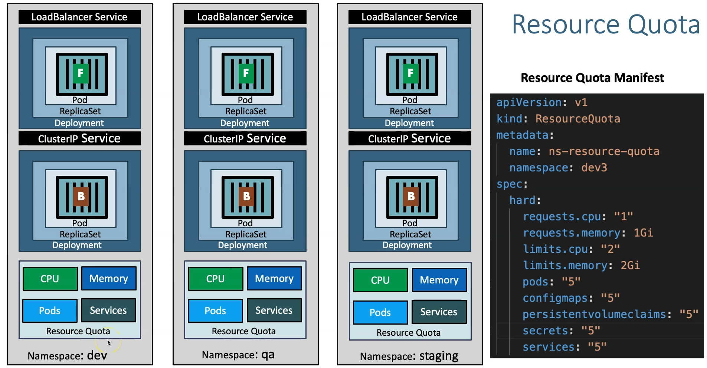

# Kubernetes Namespaces - ResourceQuota - Declarative using YAML



## Step-01: Create Namespace manifest
- **Important Note:** File name starts with `00-`  so that when creating k8s objects namespace will get created first so it don't throw an error.
```yml
apiVersion: v1
kind: Namespace
metadata:
  name: dev3
```

## Step-02: Create ResourceQuota manifest in 00- file
```yml
apiVersion: v1 
kind: ResourceQuota  # Spécifie le type de ressource Kubernetes, ici un ResourceQuota.
metadata:
  name: ns-resource-quota  # Nom de cette configuration de quota de ressources, ici 'ns-resource-quota'.
  namespace: dev3  # Associe cette ressource au namespace 'dev3'.
spec:
  hard:  # Définition des limites maximales de ressources pour le namespace 'dev3'.
    requests.cpu: "1"  # Limite totale de CPU demandé par l'ensemble des pods : 1 vCPU.
    requests.memory: 1Gi  # Limite totale de mémoire demandée par l'ensemble des pods : 1 Gi.
    limits.cpu: "2"  # Limite maximale de CPU pour l'ensemble des pods : 2 vCPU.
    limits.memory: 2Gi  # Limite maximale de mémoire pour l'ensemble des pods : 2 Gi.
    pods: "5"  # Nombre maximum de pods autorisés dans ce namespace : 5.
    configmaps: "5"  # Nombre maximum de ConfigMaps autorisés dans ce namespace : 5.
    persistentvolumeclaims: "5"  # Nombre maximum de PersistentVolumeClaims autorisés : 5.
    secrets: "5"  # Nombre maximum de secrets autorisés dans ce namespace : 5.
    services: "5"  # Nombre maximum de services autorisés dans ce namespace : 5.
                     
```


## Step-03: Create k8s objects & Test
```t
# Create All Objects
$ kubectl apply -f kube-manifests/

# List Pods
$ kubectl get pods -n dev3 -w

# View Pod Specification (CPU & Memory)
$ kubectl get pod <pod-name> -o yaml -n dev3
$ kubectl get pod usermgmt-microservice-fc67b4fbc-vkz2t -o yaml -n dev3
    ...
    resources:
      limits:
        cpu: 500m
        memory: 512Mi
      requests:
        cpu: 300m
        memory: 256Mi
    ...

# Get & Describe Limits
$ kubectl get limits -n dev3
NAME                          CREATED AT
default-cpu-mem-limit-range   2024-10-23T13:17:25Z

$ kubectl describe limits default-cpu-mem-limit-range -n dev3
Name:       default-cpu-mem-limit-range
Namespace:  dev3
Type        Resource  Min  Max  Default Request  Default Limit  Max Limit/Request Ratio
----        --------  ---  ---  ---------------  -------------  -----------------------
Container   memory    -    -    256Mi            512Mi          -
Container   cpu       -    -    300m             500m           -

# Get Resource Quota 
$ kubectl get quota -n dev3
NAME                AGE  REQUEST                                                                                                                                  LIMIT
ns-resource-quota   3m23s   configmaps: 2/5, persistentvolumeclaims: 1/5, pods: 2/5, requests.cpu: 600m/1, requests.memory: 512Mi/1Gi, secrets: 1/5, services: 2/5   limits.cpu: 1/2, limits.memory: 1Gi/2Gi

$ kubectl describe quota ns-resource-quota -n dev3
Name:                   ns-resource-quota
Namespace:              dev3
Resource                Used   Hard
--------                ----   ----
configmaps              2      5
limits.cpu              1      2
limits.memory           1Gi    2Gi
persistentvolumeclaims  1      5
pods                    2      5
requests.cpu            600m   1
requests.memory         512Mi  1Gi
secrets                 1      5
services                2      5
```
On teste l'application :

```t
# Get NodePort
kubectl get svc -n dev3

# Get Public IP of a Worker Node
kubectl get nodes -o wide

# Access Application Health Status Page
http://<WorkerNode-Public-IP>:<NodePort>/usermgmt/health-status

```
## Step-04: Clean-Up
- Delete all k8s objects created as part of this section
```
# Delete All
kubectl delete -f kube-manifests/
```

## References:
- https://kubernetes.io/docs/tasks/administer-cluster/namespaces-walkthrough/
- https://kubernetes.io/docs/tasks/administer-cluster/manage-resources/quota-memory-cpu-namespace/


## Additional References:
- https://kubernetes.io/docs/tasks/administer-cluster/manage-resources/cpu-constraint-namespace/ 
- https://kubernetes.io/docs/tasks/administer-cluster/manage-resources/memory-constraint-namespace/