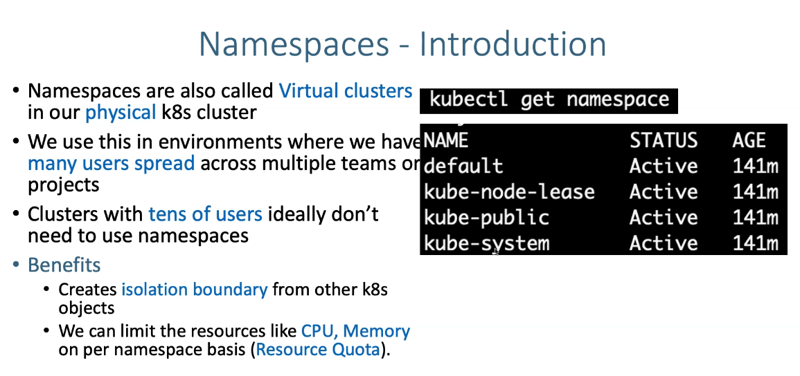
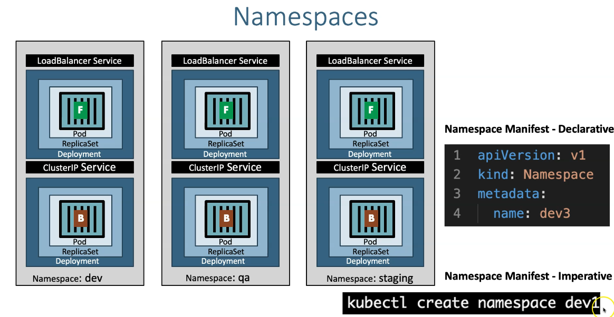

# Namespaces

- Tout est crée dans le Namespave par défaut : **default**
- Le namespace **kube-public** est lisible par tout le monde, même non authentifié
- Le namespace **kube-system** un le namespace qui contient la configuration
- Il est conseillé d'utiliser les Namespaces





## Quelques commandes

```t
# Afficher les namespaces 
$ kubectl get ns
NAME              STATUS   AGE
default           Active   30m
kube-node-lease   Active   30m
kube-public       Active   30m
kube-system       Active   30m

# Afficher tout ce que contient un namespace
$ kubectl get all -n kube-system
NAME                          READY   STATUS    RESTARTS   AGE
pod/aws-node-56htn            2/2     Running   0          18m
pod/aws-node-ldcw9            2/2     Running   0          18m
pod/coredns-cc6ccd49c-5j2jr   1/1     Running   0          25m
pod/coredns-cc6ccd49c-nnqx7   1/1     Running   0          25m
pod/kube-proxy-tblfx          1/1     Running   0          18m
pod/kube-proxy-tnd9f          1/1     Running   0          18m

NAME               TYPE        CLUSTER-IP    EXTERNAL-IP   PORT(S)                  AGE
service/kube-dns   ClusterIP   10.100.0.10   <none>        53/UDP,53/TCP,9153/TCP   25m

NAME                        DESIRED   CURRENT   READY   UP-TO-DATE   AVAILABLE   NODE SELECTOR   AGE
daemonset.apps/aws-node     2         2         2       2            2           <none>          25m
daemonset.apps/kube-proxy   2         2         2       2            2           <none>          25m

NAME                      READY   UP-TO-DATE   AVAILABLE   AGE
deployment.apps/coredns   2/2     2            2           25m

NAME                                DESIRED   CURRENT   READY   AGE
replicaset.apps/coredns-cc6ccd49c   2         2         2       25m

# Afficher tous les pods dans tous les namespaces
$ kubectl get pod --all-namespaces
NAMESPACE     NAME                      READY   STATUS    RESTARTS   AGE
kube-system   aws-node-56htn            2/2     Running   0          20m
kube-system   aws-node-ldcw9            2/2     Running   0          20m
kube-system   coredns-cc6ccd49c-5j2jr   1/1     Running   0          26m
...
```

## Chapitres


1. Namespaces - Imperative using kubectl
2. Namespaces -  Declarative using YAML & LimitRange
3. Namespaces -  Declarative using YAML & ResourceQuota
