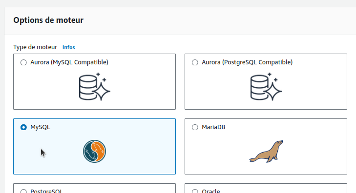

# Use RDS Database for Workloads running on AWS EKS Cluster

## Step-01: Introduction
- What are the problems with MySQL Pod & EBS CSI? 

  - La configuration Mysql que l'on a fait (1 POD, et persistance avec EBS) n'est pas acceptable en Production
  - On peut utiliser les concept du StatefulSets pour faire de la HA avec Mysql mais c'est très compliqué à mettre en oeuvre (il faut être admin mysql)
  - Encore plus dur de faire de la HA avec de la répartition Multi-Zones
  - La configuration Master-Master multi régions est encore plus dure à réaliser
  - Les disques EBS ne peuvent pas changer de région
  - Pas d'auto upgrade de Mysql
  - Pas de backup & Recovery, idem Metrics, etc.


- How we are going to solve them using AWS RDS Database?


Ce qui va donner :


**Note : possibilité pour la HA d'utiliser un Helm Chart pour Mysql par Bitnami (mais pas aussi puissant que RDS)**

## Step-02: Create RDS Database

- On va créer la db RDS dans les sous-réseaux privés

### Review VPC of our EKS Cluster
- Go to Services -> VPC
  - **VPC Name:**  eksctl-eksdemo1-cluster/VPC
  - Relever les **Private subnets**


### Pre-requisite-1: Create DB Security Group
- Create security group to allow access for RDS Database on port 3306
- Security group name: **eks_rds_db_sg**
- Description: Allow access for RDS Database on Port 3306 
- VPC: eksctl-eksdemo1-cluster/VPC
- **Inbound Rules**
  - Type: MySQL/Aurora
  - Protocol: TPC
  - Port: 3306
  - Source: Anywhere (0.0.0.0/0) => On est dans un réseau privé
  - Description: Allow access for RDS Database on Port 3306 
- **Outbound Rules**  
  - Leave to defaults


### Pre-requisite-2: Create DB Subnet Group in RDS 
- Go to RDS -> Subnet Groups
- Click on **Create DB Subnet Group**
  - **Name:** eks-rds-db-subnetgroup
  - **Description:** EKS RDS DB Subnet Group
  - **VPC:** eksctl-eksdemo1-cluster/VPC
  - **Availability Zones:** eu-west-3a, eu-west-3b
  - **Subnets:** the 2 private subnets 
  - Click on **Create**


### Create RDS Database 
- Go to  **Services -> RDS**
- Click on **Create Database**
  - **Choose a Database Creation Method:** Standard Create
  - **Engine Options:** MySQL  
  - **Edition**: MySQL Community
  - **Version**: 5.7.22  (default populated) => testé avec 8
  - **Template Size:** Free Tier
  - **DB instance identifier:** usermgmtdb
  - **Master Username:** dbadmin
  - **Master Password:** dbpassword11
  - **Confirm Password:** dbpassword11
  - **DB Instance Size:** leave to defaults
  - **Storage:** leave to defaults
  - **Connectivity**
    - **VPC:** eksctl-eksdemo1-cluster/VPC
    - **Additional Connectivity Configuration**
      - **Subnet Group:** eks-rds-db-subnetgroup
      - **Publicyly accessible:** YES (for our learning and troubleshooting - if required)
    - **VPC Security Group:** Create New
      - **Name:** eks-rds-db-securitygroup    
    - **Availability Zone:** No Preference
    - **Database Port:** 3306 
  - Rest all leave to defaults                
- Click on Create Database





Note : On aurait pu créer la base de données dans _Additionnal configuration > Initial database name_, mais pour l'exercice, on va le faire depuis le cluster.

On note les détails de la connexion à RDS :

  - Identifiant principal : dbadmin
  - Mot de passe principal : dbpassword11
  - Point de terminaison : usermgmtdb.crco8oo2w78n.eu-west-3.rds.amazonaws.com

### Edit Database Security to Allow Access from 0.0.0.0/0
- Go to **EC2 -> Security Groups -> eks-rds-db-securitygroup** 
- **Edit Inboud Rules**
  - **Source:** Anywhere (0.0.0.0/0)  (Allow access from everywhere for now)


## Step-03: Create Kubernetes externalName service Manifest and Deploy
- Create mysql externalName Service
- **01-MySQL-externalName-Service.yml**
```yml
apiVersion: v1
kind: Service
metadata:
  name: mysql
spec:
  type: ExternalName
  externalName: usermgmtdb.c7hldelt9xfp.us-east-1.rds.amazonaws.com
```
 - **Deploy Manifest**
```
kubectl apply -f kube-manifests/01-MySQL-externalName-Service.yml
```
## Step-04:  Connect to RDS Database using kubectl and create usermgmt schema/db
```
kubectl run -it --rm --image=mysql:latest --restart=Never mysql-client -- mysql -h usermgmtdb.c7hldelt9xfp.us-east-1.rds.amazonaws.com -u dbadmin -pdbpassword11

mysql> show schemas;
mysql> create database usermgmt;
mysql> show schemas;
mysql> exit
```
## Step-05: In User Management Microservice deployment file change username from `root` to `dbadmin`
- **02-UserManagementMicroservice-Deployment-Service.yml**
```yml
# Change From
          - name: DB_USERNAME
            value: "root"

# Change To
          - name: DB_USERNAME
            value: "dbadmin"            
```

## Step-06: Deploy User Management Microservice and Test
```
# Deploy all Manifests
kubectl apply -f kube-manifests/

# List Pods
kubectl get pods

# Stream pod logs to verify DB Connection is successful from SpringBoot Application
kubectl logs -f <pod-name>
```
## Step-07: Access Application
```
# Capture Worker Node External IP or Public IP
kubectl get nodes -o wide

# Access Application
http://<Worker-Node-Public-Ip>:31231/usermgmt/health-status
```

## Step-08: Clean Up 
```
# Delete all Objects created
kubectl delete -f kube-manifests/

# Verify current Kubernetes Objects
kubectl get all
```
