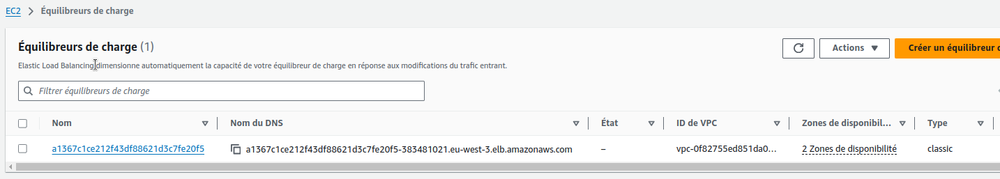

# AWS - Classic Load Balancer - CLB

## Step-01: Create AWS Classic Load Balancer Kubernetes Manifest & Deploy
- **04-ClassicLoadBalancer.yml**
```yml
apiVersion: v1
kind: Service
metadata:
  name: clb-usermgmt-restapp
  labels:
    app: usermgmt-restapp
spec:
  type: LoadBalancer  # Regular k8s Service manifest with type as LoadBalancer
  selector:
    app: usermgmt-restapp     
  ports:
  - port: 80
    targetPort: 8095
```
- **Deploy all Manifest**
```
# Deploy all manifests
$ kubectl apply -f kube-manifests/
service/mysql created
deployment.apps/usermgmt-microservice created
secret/mysql-db-password created
service/clb-usermgmt-restapp created

# List Services (Verify newly created CLB Service)
$ kubectl get svc
NAME                   TYPE           CLUSTER-IP       EXTERNAL-IP                                                              PORT(S)        AGE
clb-usermgmt-restapp   LoadBalancer   10.100.217.217   a1367c1ce212f43df88621d3c7fe20f5-383481021.eu-west-3.elb.amazonaws.com   80:32027/TCP   3m56s
kubernetes             ClusterIP      10.100.0.1       <none>                                                                   443/TCP        37m
mysql                  ExternalName   <none>           usermgmtdb.crco8oo2w78n.eu-west-3.rds.amazonaws.com                      <none>         3m56s

# Verify Pods
kubectl get pods
```

## Step-02: Verify the deployment
- Verify if new CLB got created 
  - Go to  Services -> EC2 -> Load Balancing -> Load Balancers 
    - Classic LB should be created
    - Copy DNS Name (Example: a85ae6e4030aa4513bd200f08f1eb9cc-7f13b3acc1bcaaa2.elb.us-east-1.amazonaws.com)



- **Access Application** 
```t
# Access Application
http://<CLB-DNS-NAME>/usermgmt/health-status
http://a1367c1ce212f43df88621d3c7fe20f5-383481021.eu-west-3.elb.amazonaws.com/usermgmt/health-status
```    

On peut voir : _User Management Service UP and RUNNING - V1_


## Step-03: Clean Up 
```
# Delete all Objects created
kubectl delete -f kube-manifests/

# Verify current Kubernetes Objects
kubectl get all
```