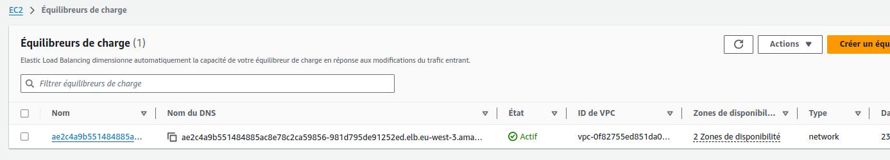
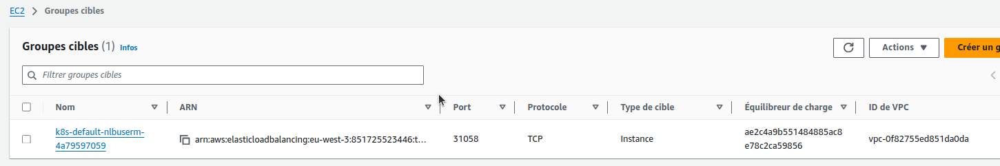
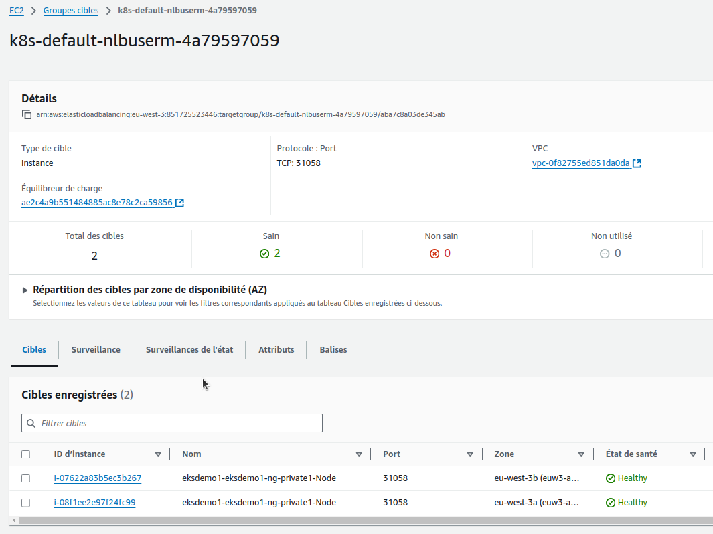

 # AWS - Network Load Balancer - NLB

- Load Balancer TCP (couche 4)

**Note:** On vérifie le endpoint RDS dans 01-MySQL-externalName-Service.yml

## Step-01: Create AWS Network Load Balancer Kubernetes Manifest & Deploy
- **04-NetworkLoadBalancer.yml**

On utilise l'annotation **service.beta.kubernetes.io/aws-load-balancer-type: nlb**

```yml
apiVersion: v1
kind: Service
metadata:
  name: nlb-usermgmt-restapp
  labels:
    app: usermgmt-restapp
  annotations:
    service.beta.kubernetes.io/aws-load-balancer-type: nlb    # To create Network Load Balancer
spec:
  type: LoadBalancer # Regular k8s Service manifest with type as LoadBalancer
  selector:
    app: usermgmt-restapp     
  ports:
  - port: 80
    targetPort: 8095
```
- **Deploy all Manifest**
```t
# Deploy all manifests
$ kubectl apply -f kube-manifests/
service/mysql created
deployment.apps/usermgmt-microservice created
secret/mysql-db-password created
service/nlb-usermgmt-restapp created

# List Services (Verify newly created NLB Service)
kubectl get svc
NAME                   TYPE           CLUSTER-IP      EXTERNAL-IP                                                                     PORT(S)        AGE
kubernetes             ClusterIP      10.100.0.1      <none>                                                                          443/TCP        55m
mysql                  ExternalName   <none>          usermgmtdb.cxojydmxwly6.us-east-1.rds.amazonaws.com                             <none>         15s
nlb-usermgmt-restapp   LoadBalancer   10.100.38.189   ae2c4a9b551484885ac8e78c2ca59856-981d795de91252ed.elb.eu-west-3.amazonaws.com   80:31058/TCP   15s

# Verify Pods
kubectl get pods
```

## Step-02: Verify the deployment
- Verify if new CLB got created 
  - Go to  Services -> EC2 -> Load Balancing -> Load Balancers 
    - CLB should be created
    - Copy DNS Name (Example: a85ae6e4030aa4513bd200f08f1eb9cc-7f13b3acc1bcaaa2.elb.us-east-1.amazonaws.com)



  - Go to  Services -> EC2 -> Load Balancing -> Target Groups
    - Verify the health status, we should see active. 






- **Access Application** 
```t
# Access Application
http://<NLB-DNS-NAME>/usermgmt/health-status
http://ae2c4a9b551484885ac8e78c2ca59856-981d795de91252ed.elb.eu-west-3.amazonaws.com/usermgmt/health-status
```    

On peut voir : _User Management Service UP and RUNNING - V1_

## Step-03: Clean Up 
```
# Delete all Objects created
kubectl delete -f kube-manifests/

# Verify current Kubernetes Objects
kubectl get all
```


