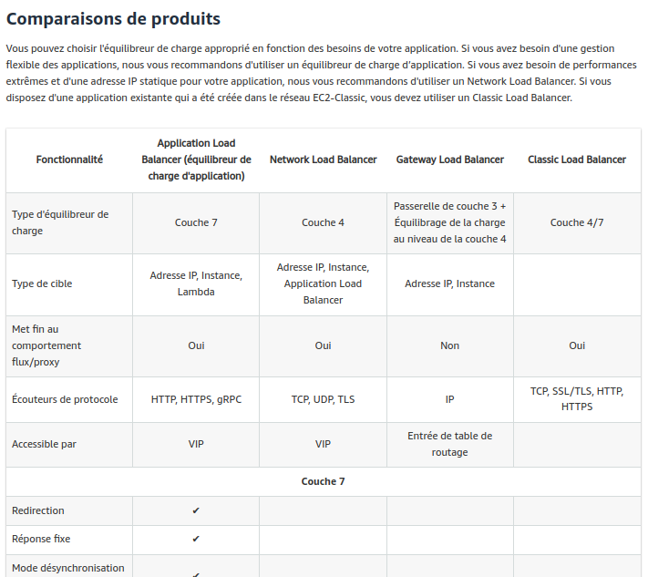

# AWS Elastic Load Balancers

**Comparatif des LB** : https://aws.amazon.com/fr/elasticloadbalancing/features/?nc=sn&loc=2&dn=1

- Maintenant, il y a le **Gateway LoadBalancer** 

Architecture avec Le Classic LD :

Architecture avec Le Network LD :

## AWS Load Balancer Types
1. Classic Load Balancer

- Deprecated

2. Network Load Balancer
3. Application Load Balancer  (k8s Ingress)