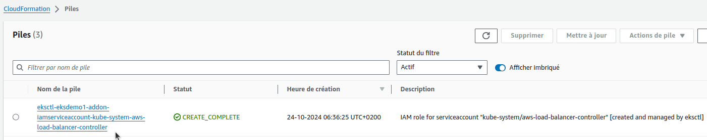
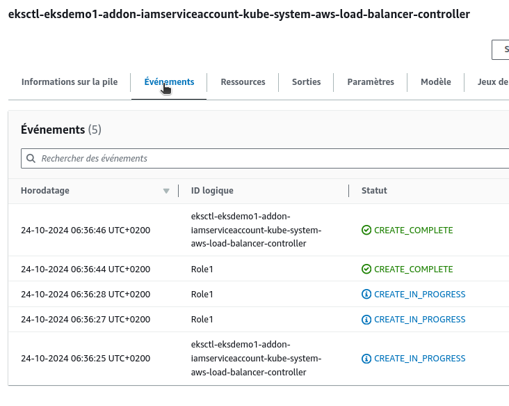
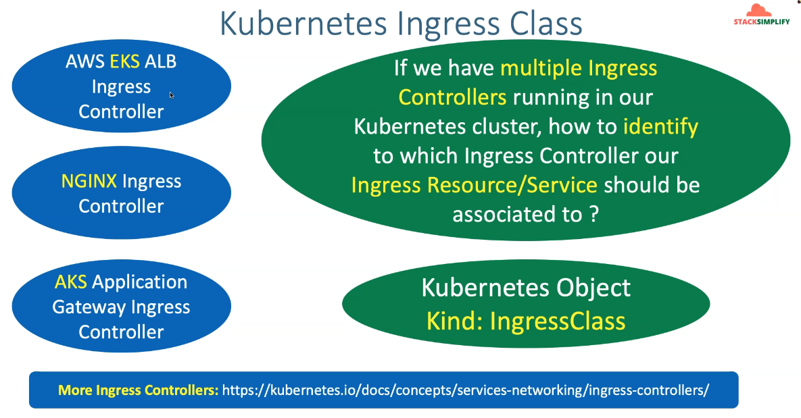
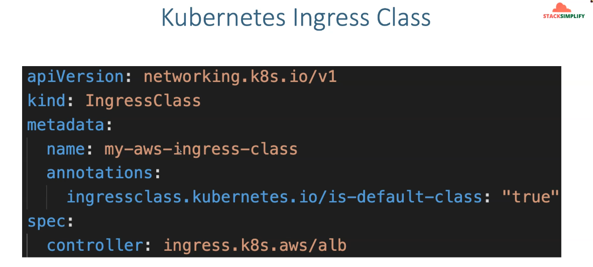
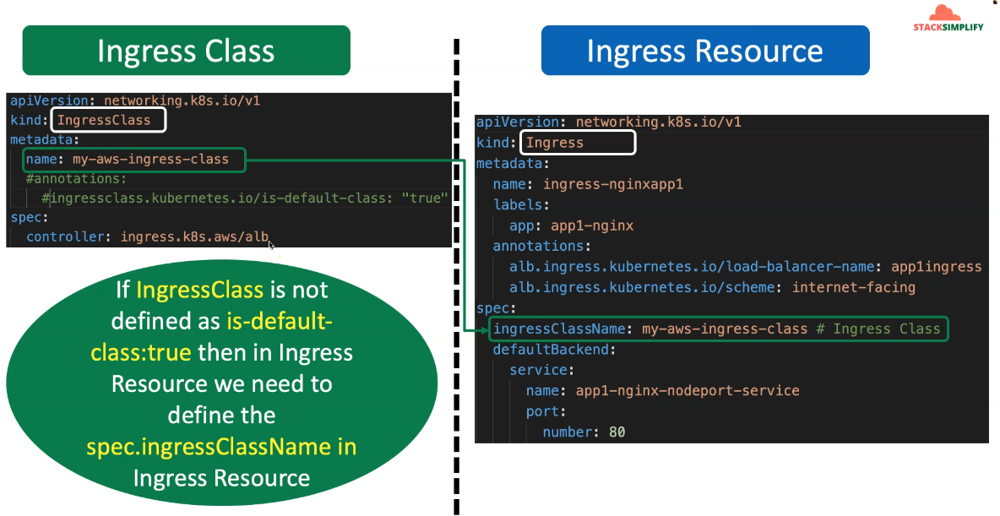

 

## Step-00: Introduction
1. Create IAM Policy and make a note of Policy ARN
2. Create IAM Role and k8s Service Account and bound them together
3. Install AWS Load Balancer Controller using HELM3 CLI
4. Understand IngressClass Concept and create a default Ingress Class 

## Step-01: Pre-requisites
### Pre-requisite-1: eksctl & kubectl Command Line Utility
- Should be the latest eksctl version
```t
# Verify eksctl version
eksctl version

# For installing or upgrading latest eksctl version
https://docs.aws.amazon.com/eks/latest/userguide/eksctl.html

# Verify EKS Cluster version
kubectl version
Important Note: You must use a kubectl version that is within one minor version difference of your Amazon EKS cluster control plane. For example, a 1.20 kubectl client works with Kubernetes 1.19, 1.20 and 1.21 clusters.

# For installing kubectl cli
https://docs.aws.amazon.com/eks/latest/userguide/install-kubectl.html
```
### Pre-requisite-2: Create EKS Cluster and Worker Nodes (if not created)
```t
# Create Cluster (Section-01-02)
eksctl create cluster --name=eksdemo1 \
                      --region=eu-west-3 \
                      --zones=eu-west-3a,eu-west-3b \
                      --version="1.31" \
                      --without-nodegroup 

# Get List of clusters (Section-01-02)
eksctl get cluster   

# Template (Section-01-02)
eksctl utils associate-iam-oidc-provider \
    --region region-code \
    --cluster <cluter-name> \
    --approve

# Replace with region & cluster name (Section-01-02)
eksctl utils associate-iam-oidc-provider \
    --region eu-west-3 \
    --cluster eksdemo1 \
    --approve

# Create EKS NodeGroup in VPC Private Subnets (Section-07-01)
eksctl create nodegroup --cluster=eksdemo1 \
                        --region=us-east-1 \
                        --name=eksdemo1-ng-private1 \
                        --node-type=t3.medium \
                        --nodes=2 \
                        --nodes-min=2 \
                        --nodes-max=4 \
                        --node-volume-size=20 \
                        --ssh-access \
                        --ssh-public-key=kube-demo \
                        --managed \
                        --asg-access \
                        --external-dns-access \
                        --full-ecr-access \
                        --appmesh-access \
                        --alb-ingress-access \
                        --node-private-networking       
```
### Pre-requisite-3:  Verify Cluster, Node Groups and configure kubectl cli if not configured
1. EKS Cluster
2. EKS Node Groups in Private Subnets
```t
# Verfy EKS Cluster
$ eksctl get cluster
NAME            REGION          EKSCTL CREATED
eksdemo1        eu-west-3       True

# Verify EKS Node Groups
$ eksctl get nodegroup --cluster=eksdemo1
CLUSTER         NODEGROUP               STATUS  CREATED                 MIN SIZE        MAX SIZE        DESIRED CAPACITY        INSTANCE TYPE   IMAGE ID        ASG NAME    TYPE
eksdemo1        eksdemo1-ng-private1    ACTIVE  2024-10-24T04:18:14Z    2               4               2                       t3.medium       AL2_x86_64      eks-eksdemo1-ng-private1-68c95e5f-899e-c2e4-d61a-3f62915353a5        managed

# Verify if any IAM Service Accounts present in EKS Cluster
$ eksctl get iamserviceaccount --cluster=eksdemo1
No iamserviceaccounts found

Observation:
1. No k8s Service accounts as of now. 

# Configure kubeconfig for kubectl
$ eksctl get cluster # TO GET CLUSTER NAME
$ aws eks --region <region-code> update-kubeconfig --name <cluster_name>
$ aws eks --region eu-west-3 update-kubeconfig --name eksdemo1

# Verify EKS Nodes in EKS Cluster using kubectl
$ kubectl get nodes
NAME                                           STATUS   ROLES    AGE   VERSION
ip-192-168-127-30.eu-west-3.compute.internal   Ready    <none>   11m   v1.31.0-eks-a737599
ip-192-168-80-143.eu-west-3.compute.internal   Ready    <none>   11m   v1.31.0-eks-a737599

# Verify using AWS Management Console
1. EKS EC2 Nodes (Verify Subnet in Networking Tab)
2. EKS Cluster
```

## Step-02: Create IAM Policy
- Créer une politique IAM pour le contrôleur AWS Load Balancer qui lui permette de faire des appels aux API AWS en votre nom.
- À ce jour, 2.3.1 est la dernière version du contrôleur Load Balancer.
- Nous téléchargerons toujours la version la plus récente depuis la branche principale du dépôt Git.
- [AWS Load Balancer Controller Main Git repo](https://github.com/kubernetes-sigs/aws-load-balancer-controller)
```t
# Change Directroy
cd 08-ELB-Application-LoadBalancers/
cd 08-01-Load-Balancer-Controller-Install

# Delete files before download (if any present)
rm iam_policy_latest.json

# Download IAM Policy
## Download latest
curl -o iam_policy_latest.json https://raw.githubusercontent.com/kubernetes-sigs/aws-load-balancer-controller/main/docs/install/iam_policy.json
## Verify latest
ls -lrta 

## Download specific version
curl -o iam_policy_v2.3.1.json https://raw.githubusercontent.com/kubernetes-sigs/aws-load-balancer-controller/v2.3.1/docs/install/iam_policy.json


# Create IAM Policy using policy downloaded 
aws iam create-policy \
    --policy-name AWSLoadBalancerControllerIAMPolicy \
    --policy-document file://iam_policy_latest.json

## Sample Output
$ aws iam create-policy \
>     --policy-name AWSLoadBalancerControllerIAMPolicy \
>     --policy-document file://iam_policy_latest.json
{
    "Policy": {
        "PolicyName": "AWSLoadBalancerControllerIAMPolicy",
        "PolicyId": "ANPASUF7HC7S52ZQAPETR",
        "Arn": "arn:aws:iam::851725523446:policy/AWSLoadBalancerControllerIAMPolicy",
        "Path": "/",
        "DefaultVersionId": "v1",
        "AttachmentCount": 0,
        "PermissionsBoundaryUsageCount": 0,
        "IsAttachable": true,
        "CreateDate": "2022-02-02T04:51:21+00:00",
        "UpdateDate": "2022-02-02T04:51:21+00:00"
    }
}
$ 
```
- **Important Note:** If you view the policy in the AWS Management Console, you may see warnings for ELB. These can be safely ignored because some of the actions only exist for ELB v2. You do not see warnings for ELB v2.

### Make a note of Policy ARN    
- Make a note of Policy ARN as we are going to use that in next step when creating IAM Role.
```t
# Policy ARN 
Policy ARN:  arn:aws:iam::851725523446:policy/AWSLoadBalancerControllerIAMPolicy
```

## Step-03: Create an IAM role for the AWS LoadBalancer Controller and attach the role to the Kubernetes service account 
- Applicable only with `eksctl` managed clusters
- This command will create an AWS IAM role 
- This command also will create Kubernetes Service Account in k8s cluster
- In addition, this command will bound IAM Role created and the Kubernetes service account created
### Step-03-01: Create IAM Role using eksctl
```t
# Verify if any existing service account
$ kubectl get sa -n kube-system
NAME                                          SECRETS   AGE
attachdetach-controller                       0         22m
aws-cloud-provider                            0         22m
aws-node                                      0         20m
certificate-controller                        0         22m
clusterrole-aggregation-controller            0         22m
...

$ kubectl get sa aws-load-balancer-controller -n kube-system
Error from server (NotFound): serviceaccounts "aws-load-balancer-controller" not found

Observation:
1. Nothing with name "aws-load-balancer-controller" should exist

# Template
eksctl create iamserviceaccount \
  --cluster=my_cluster \
  --namespace=kube-system \
  --name=aws-load-balancer-controller \ #Note:  K8S Service Account Name that need to be bound to newly created IAM Role
  --attach-policy-arn=arn:aws:iam::111122223333:policy/AWSLoadBalancerControllerIAMPolicy \
  --override-existing-serviceaccounts \
  --approve


# Replaced name, cluster and policy arn (Policy arn we took note in step-02)
$ eksctl create iamserviceaccount \
  --cluster=eksdemo1 \
  --namespace=kube-system \
  --name=aws-load-balancer-controller \
  --attach-policy-arn=arn:aws:iam::851725523446:policy/AWSLoadBalancerControllerIAMPolicy \
  --override-existing-serviceaccounts \
  --approve
```
- **Sample Output**
```t
# Sample Output for IAM Service Account creation
$ eksctl create iamserviceaccount \
>   --cluster=eksdemo1 \
>   --namespace=kube-system \
>   --name=aws-load-balancer-controller \
>   --attach-policy-arn=arn:aws:iam::180789647333:policy/AWSLoadBalancerControllerIAMPolicy \
>   --override-existing-serviceaccounts \
>   --approve
2022-02-02 10:22:49 [ℹ]  eksctl version 0.82.0
2022-02-02 10:22:49 [ℹ]  using region us-east-1
2022-02-02 10:22:52 [ℹ]  1 iamserviceaccount (kube-system/aws-load-balancer-controller) was included (based on the include/exclude rules)
2022-02-02 10:22:52 [!]  metadata of serviceaccounts that exist in Kubernetes will be updated, as --override-existing-serviceaccounts was set
2022-02-02 10:22:52 [ℹ]  1 task: { 
    2 sequential sub-tasks: { 
        create IAM role for serviceaccount "kube-system/aws-load-balancer-controller",
        create serviceaccount "kube-system/aws-load-balancer-controller",
    } }2022-02-02 10:22:52 [ℹ]  building iamserviceaccount stack "eksctl-eksdemo1-addon-iamserviceaccount-kube-system-aws-load-balancer-controller"
2022-02-02 10:22:53 [ℹ]  deploying stack "eksctl-eksdemo1-addon-iamserviceaccount-kube-system-aws-load-balancer-controller"
2022-02-02 10:22:53 [ℹ]  waiting for CloudFormation stack "eksctl-eksdemo1-addon-iamserviceaccount-kube-system-aws-load-balancer-controller"
2022-02-02 10:23:10 [ℹ]  waiting for CloudFormation stack "eksctl-eksdemo1-addon-iamserviceaccount-kube-system-aws-load-balancer-controller"
2022-02-02 10:23:29 [ℹ]  waiting for CloudFormation stack "eksctl-eksdemo1-addon-iamserviceaccount-kube-system-aws-load-balancer-controller"
2022-02-02 10:23:32 [ℹ]  created serviceaccount "kube-system/aws-load-balancer-controller"
```

### Step-03-02: Verify using eksctl cli
```t
# Get IAM Service Account
$ eksctl  get iamserviceaccount --cluster eksdemo1
NAMESPACE       NAME                            ROLE ARN
kube-system     aws-load-balancer-controller    arn:aws:iam::851725523446:role/eksctl-eksdemo1-addon-iamserviceaccount-kube--Role1-9v8hMPc6tssx
```

### Step-03-03: Verify CloudFormation Template eksctl created & IAM Role
- Goto Services -> CloudFormation
- **CFN Template Name:** eksctl-eksdemo1-addon-iamserviceaccount-kube-system-aws-load-balancer-controller
- Click on **Resources** tab
- Click on link in **Physical Id** to open the IAM Role
- Verify it has **eksctl-eksdemo1-addon-iamserviceaccount-kube-Role1-WFAWGQKTAVLR** associated





### Step-03-04: Verify k8s Service Account using kubectl
```t
# Verify if any existing service account
$ kubectl get sa -n kube-system
...
aws-load-balancer-controller 
...


$ kubectl get sa aws-load-balancer-controller -n kube-system
NAME                           SECRETS   AGE
aws-load-balancer-controller   0         6m28s

Observation:
1. We should see a new Service account created. 

# Describe Service Account aws-load-balancer-controller
$ kubectl describe sa aws-load-balancer-controller -n kube-system
Name:                aws-load-balancer-controller
Namespace:           kube-system
Labels:              app.kubernetes.io/managed-by=eksctl
Annotations:         eks.amazonaws.com/role-arn: arn:aws:iam::851725523446:role/eksctl-eksdemo1-addon-iamserviceaccount-kube--Role1-9v8hMPc6tssx
Image pull secrets:  <none>
Mountable secrets:   <none>
Tokens:              <none>
Events:              <none>

```
- **Observation:** You can see that newly created Role ARN is added in `Annotations` confirming that **AWS IAM role bound to a Kubernetes service account**

## Step-04: Install the AWS Load Balancer Controller using Helm V3 
### Step-04-01: Install Helm
- [Install Helm](https://helm.sh/docs/intro/install/) if not installed
- [Install Helm for AWS EKS](https://docs.aws.amazon.com/eks/latest/userguide/helm.html)
```t
# Install Helm (if not installed) MacOS
brew install helm

# Verify Helm version
helm version
version.BuildInfo{Version:"v3.16.2", GitCommit:"13654a52f7c70a143b1dd51416d633e1071faffb", GitTreeState:"clean", GoVersion:"go1.22.7"}
```
### Step-04-02: Install AWS Load Balancer Controller
- **Important-Note-1:** If you're deploying the controller to Amazon EC2 nodes that have restricted access to the Amazon EC2 instance metadata service (IMDS), or if you're deploying to Fargate, then add the following flags to the command that you run:
```t
--set region=region-code
--set vpcId=vpc-xxxxxxxx
```
- **Important-Note-2:** If you're deploying to any Region other than us-west-2, then add the following flag to the command that you run, replacing account and region-code with the values for your region listed in Amazon EKS add-on container image addresses.
- [Get Region Code and Account info](https://docs.aws.amazon.com/eks/latest/userguide/add-ons-images.html)
```t
--set image.repository=account.dkr.ecr.region-code.amazonaws.com/amazon/aws-load-balancer-controller
```
```t
# Add the eks-charts repository.
$ helm repo add eks https://aws.github.io/eks-charts
"eks" has been added to your repositories

# Update your local repo to make sure that you have the most recent charts.
$ helm repo update
...
...Successfully got an update from the "eks" chart repository
...

# Install the AWS Load Balancer Controller.
## Template
helm install aws-load-balancer-controller eks/aws-load-balancer-controller \
  -n kube-system \
  --set clusterName=<cluster-name> \
  --set serviceAccount.create=false \
  --set serviceAccount.name=aws-load-balancer-controller \
  --set region=<region-code> \
  --set vpcId=<vpc-xxxxxxxx> \
  --set image.repository=<account>.dkr.ecr.<region-code>.amazonaws.com/amazon/aws-load-balancer-controller

## Replace Cluster Name, Region Code, VPC ID, Image Repo Account ID and Region Code  
$ helm install aws-load-balancer-controller eks/aws-load-balancer-controller \
  -n kube-system \
  --set clusterName=eksdemo1 \
  --set serviceAccount.create=false \
  --set serviceAccount.name=aws-load-balancer-controller \
  --set region=eu-west-3 \
  --set vpcId=vpc-00e9bb44cfc6e9b00 \
  --set image.repository=602401143452.dkr.ecr.eu-west-3.amazonaws.com/amazon/aws-load-balancer-controller

NAME: aws-load-balancer-controller
LAST DEPLOYED: Thu Oct 24 06:50:52 2024
NAMESPACE: kube-system
STATUS: deployed
REVISION: 1
TEST SUITE: None
NOTES:
AWS Load Balancer controller installed!
```

### Step-04-03: Verify that the controller is installed and Webhook Service created
```t
# Verify that the controller is installed.
$ kubectl -n kube-system get deployment 
NAME                           READY   UP-TO-DATE   AVAILABLE   AGE
aws-load-balancer-controller   2/2     2            2           51s
coredns                        2/2     2            2           37m

$ kubectl -n kube-system get deployment aws-load-balancer-controller
NAME                           READY   UP-TO-DATE   AVAILABLE   AGE
aws-load-balancer-controller   2/2     2            2           65s
```

```
$ kubectl -n kube-system describe deployment aws-load-balancer-controller
Namespace:              kube-system
CreationTimestamp:      Thu, 24 Oct 2024 06:50:55 +0200
Labels:                 app.kubernetes.io/instance=aws-load-balancer-controller
                        app.kubernetes.io/managed-by=Helm
                        app.kubernetes.io/name=aws-load-balancer-controller
                        app.kubernetes.io/version=v2.9.2
                        helm.sh/chart=aws-load-balancer-controller-1.9.2
Annotations:            deployment.kubernetes.io/revision: 1
                        meta.helm.sh/release-name: aws-load-balancer-controller
                        meta.helm.sh/release-namespace: kube-system
Selector:               app.kubernetes.io/instance=aws-load-balancer-controller,app.kubernetes.io/name=aws-load-balancer-controller
Replicas:               2 desired | 2 updated | 2 total | 2 available | 0 unavailable
StrategyType:           RollingUpdate
MinReadySeconds:        0
RollingUpdateStrategy:  25% max unavailable, 25% max surge
Pod Template:
  Labels:           app.kubernetes.io/instance=aws-load-balancer-controller
                    app.kubernetes.io/name=aws-load-balancer-controller
  Annotations:      prometheus.io/port: 8080
                    prometheus.io/scrape: true
  Service Account:  aws-load-balancer-controller
  Containers:
   aws-load-balancer-controller:
    Image:       602401143452.dkr.ecr.eu-west-3.amazonaws.com/amazon/aws-load-balancer-controller:v2.9.2
    Ports:       9443/TCP, 8080/TCP
    Host Ports:  0/TCP, 0/TCP
    Args:
      --cluster-name=eksdemo1
      --ingress-class=alb
      --aws-region=eu-west-3
      --aws-vpc-id=vpc-00e9bb44cfc6e9b00
    Liveness:     http-get http://:61779/healthz delay=30s timeout=10s period=10s #success=1 #failure=2
    Readiness:    http-get http://:61779/readyz delay=10s timeout=10s period=10s #success=1 #failure=2
    Environment:  <none>
    Mounts:
      /tmp/k8s-webhook-server/serving-certs from cert (ro)
  Volumes:
   cert:
    Type:               Secret (a volume populated by a Secret)
    SecretName:         aws-load-balancer-tls
    Optional:           false
  Priority Class Name:  system-cluster-critical
  Node-Selectors:       <none>
  Tolerations:          <none>
Conditions:
  Type           Status  Reason
  ----           ------  ------
  Available      True    MinimumReplicasAvailable
  Progressing    True    NewReplicaSetAvailable
OldReplicaSets:  <none>
NewReplicaSet:   aws-load-balancer-controller-8649df4674 (2/2 replicas created)
Events:
  Type    Reason             Age   From                   Message
  ----    ------             ----  ----                   -------
  Normal  ScalingReplicaSet  77s   deployment-controller  Scaled up replica set aws-load-balancer-controller-8649df4674 to 2
```

```t
# Verify AWS Load Balancer Controller Webhook service created
$ kubectl -n kube-system get svc 
NAME                                TYPE        CLUSTER-IP      EXTERNAL-IP   PORT(S)                  AGE
aws-load-balancer-webhook-service   ClusterIP   10.100.173.31   <none>        443/TCP                  3m13s
kube-dns                            ClusterIP   10.100.0.10     <none>        53/UDP,53/TCP,9153/TCP   39m

$ kubectl -n kube-system get svc aws-load-balancer-webhook-service
NAME                                TYPE        CLUSTER-IP      EXTERNAL-IP   PORT(S)   AGE
aws-load-balancer-webhook-service   ClusterIP   10.100.173.31   <none>        443/TCP   3m38s

$ kubectl -n kube-system describe svc aws-load-balancer-webhook-service
Name:                     aws-load-balancer-webhook-service
Namespace:                kube-system
Labels:                   app.kubernetes.io/component=webhook
                          app.kubernetes.io/instance=aws-load-balancer-controller
                          app.kubernetes.io/managed-by=Helm
                          app.kubernetes.io/name=aws-load-balancer-controller
                          app.kubernetes.io/version=v2.9.2
                          helm.sh/chart=aws-load-balancer-controller-1.9.2
                          prometheus.io/service-monitor=false
Annotations:              meta.helm.sh/release-name: aws-load-balancer-controller
                          meta.helm.sh/release-namespace: kube-system
Selector:                 app.kubernetes.io/instance=aws-load-balancer-controller,app.kubernetes.io/name=aws-load-balancer-controller
Type:                     ClusterIP
IP Family Policy:         SingleStack
IP Families:              IPv4
IP:                       10.100.173.31
IPs:                      10.100.173.31
Port:                     webhook-server  443/TCP
TargetPort:               webhook-server/TCP
Endpoints:                192.168.82.96:9443,192.168.98.249:9443
Session Affinity:         None
Internal Traffic Policy:  Cluster
Events:                   <none>

# Verify Labels in Service and Selector Labels in Deployment
$ kubectl -n kube-system get svc aws-load-balancer-webhook-service -o yaml
...
  selector:
    app.kubernetes.io/instance: aws-load-balancer-controller
    app.kubernetes.io/name: aws-load-balancer-controller
...

$ kubectl -n kube-system get deployment aws-load-balancer-controller -o yaml
...
  selector:
    matchLabels:
      app.kubernetes.io/instance: aws-load-balancer-controller
      app.kubernetes.io/name: aws-load-balancer-controller
...

Observation:
1. Verify "spec.selector" label in "aws-load-balancer-webhook-service"
2. Compare it with "aws-load-balancer-controller" Deployment "spec.selector.matchLabels"
3. Both values should be same which traffic coming to "aws-load-balancer-webhook-service" on port 443 will be sent to port 9443 on "aws-load-balancer-controller" deployment related pods. 
```

### Step-04-04: Verify AWS Load Balancer Controller Logs
```t
# List Pods
$ kubectl get pods -n kube-system
NAME                                            READY   STATUS    RESTARTS   AGE
aws-load-balancer-controller-8649df4674-7qzw2   1/1     Running   0          8m28s
aws-load-balancer-controller-8649df4674-lgmnw   1/1     Running   0          8m28s
aws-node-dt7ck                                  2/2     Running   0          39m
aws-node-ps2hs                                  2/2     Running   0          39m
coredns-fcb664567-5z47w                         1/1     Running   0          44m
coredns-fcb664567-bj4kr                         1/1     Running   0          44m
kube-proxy-5b62x                                1/1     Running   0          39m
kube-proxy-rhkjg                                1/1     Running   0          39m

# List all in kube-system namespace 
$ kubectl get all -n kube-system
NAME                                                READY   STATUS    RESTARTS   AGE
pod/aws-load-balancer-controller-8649df4674-7qzw2   1/1     Running   0          13m
pod/aws-load-balancer-controller-8649df4674-lgmnw   1/1     Running   0          13m
pod/aws-node-dt7ck                                  2/2     Running   0          44m
pod/aws-node-ps2hs                                  2/2     Running   0          44m
pod/coredns-fcb664567-5z47w                         1/1     Running   0          49m
pod/coredns-fcb664567-bj4kr                         1/1     Running   0          49m
pod/kube-proxy-5b62x                                1/1     Running   0          44m
pod/kube-proxy-rhkjg                                1/1     Running   0          44m

NAME                                        TYPE        CLUSTER-IP      EXTERNAL-IP   PORT(S)                  AGE
service/aws-load-balancer-webhook-service   ClusterIP   10.100.173.31   <none>        443/TCP                  13m
service/kube-dns                            ClusterIP   10.100.0.10     <none>        53/UDP,53/TCP,9153/TCP   49m

NAME                        DESIRED   CURRENT   READY   UP-TO-DATE   AVAILABLE   NODE SELECTOR   AGE
daemonset.apps/aws-node     2         2         2       2            2           <none>          49m
daemonset.apps/kube-proxy   2         2         2       2            2           <none>          49m

NAME                                           READY   UP-TO-DATE   AVAILABLE   AGE
deployment.apps/aws-load-balancer-controller   2/2     2            2           13m
deployment.apps/coredns                        2/2     2            2           49m

NAME                                                      DESIRED   CURRENT   READY   AGE
replicaset.apps/aws-load-balancer-controller-8649df4674   2         2         2       13m
replicaset.apps/coredns-fcb664567                         2         2         2       49m

# Review logs for AWS LB Controller POD-1 looking for errors (only info here = ok)
$ kubectl -n kube-system logs -f <POD-NAME> 
$ kubectl -n kube-system logs -f  aws-load-balancer-controller-8649df4674-7qzw2
level:info.....

# Review logs for AWS LB Controller POD-2 looking for errors (only info here = ok)
kubectl -n kube-system logs -f <POD-NAME> 
kubectl -n kube-system logs -f aws-load-balancer-controller-8649df4674-lgmnw
```

### Step-04-05: Verify AWS Load Balancer Controller k8s Service Account - Internals 
```t
# List Service Account and its secret
$ kubectl -n kube-system get sa aws-load-balancer-controller
NAME                           SECRETS   AGE
aws-load-balancer-controller   0         23m
```

Pas de secrets token contrairement à la vidéo 89 :

```
$ kubectl -n kube-system get sa aws-load-balancer-controller -o yaml
apiVersion: v1
kind: ServiceAccount
metadata:
  annotations:
    eks.amazonaws.com/role-arn: arn:aws:iam::851725523446:role/eksctl-eksdemo1-addon-iamserviceaccount-kube--Role1-9v8hMPc6tssx
  creationTimestamp: "2024-10-24T04:36:55Z"
  labels:
    app.kubernetes.io/managed-by: eksctl
  name: aws-load-balancer-controller
  namespace: kube-system
  resourceVersion: "4473"
  uid: 607bb6cf-3cdb-49ef-8330-486d131afad6
```

L'api a changé : https://www.linkedin.com/pulse/service-account-token-changes-kubernetes-version-124-shafeeque-aslam/ 

Les commandes suivantes ne marchent pas car pas de aws-load-balancer-controller-token-xxxxxx :

```t
$ kubectl -n kube-system get secret <GET_FROM_PREVIOUS_COMMAND - secrets.name> -o yaml

$ kubectl -n kube-system get secret aws-load-balancer-controller-token-5w8th 

$ kubectl -n kube-system get secret aws-load-balancer-controller-token-5w8th -o yaml

## Decoce ca.crt using below two websites
https://www.base64decode.org/
https://www.sslchecker.com/certdecoder

## Decode token using below two websites
https://www.base64decode.org/
https://jwt.io/
Observation:
1. Review decoded JWT Token


```
D'après les Q/R de la vidéo :

When you create a service account in Kubernetes, it automatically creates a corresponding secret of type kubernetes.io/service-account-token that is used to authenticate the service account when accessing the Kubernetes API.

From the YAML output you provided, it seems you're looking at the ServiceAccount (aws-load-balancer-controller) configuration in the kube-system namespace. However, the associated secret is not directly listed in the ServiceAccount YAML output.

To find the associated secret for the service account, you can do the following:

Get the secrets in the kube-system namespace and filter them based on the service account name:

$ kubectl get secrets -n kube-system | grep aws-load-balancer-controller

Once you identify the secret name from the above command, you can describe or fetch it using:

$ kubectl get secret <secret-name> -n kube-system -o yaml

Replace <secret-name> with the actual secret name from the first command.

However, I noticed that the service account has an associated annotation eks.amazonaws.com/role-arn, which indicates that the service account has an associated IAM role through EKS's IAM Roles for Service Account (IRSA) feature. This means applications using this service account will assume the given IAM role rather than using the default service account token. The token used to assume the IAM role is injected into the pod, and it is different from the typical Kubernetes service account token. If you're specifically looking for this token for debugging purposes, you'd need to check the environment variables and token locations inside a pod that uses this service account.

**Conclusion :** L'api a changé et les vérifications internes ne marchent pas, ce n'est pas grave, il faut juste vérifier que les logs sont ok (sans erreur)

```t
# List Deployment in YAML format
$ kubectl -n kube-system get deploy aws-load-balancer-controller -o yaml
...
      serviceAccount: aws-load-balancer-controller
      serviceAccountName: aws-load-balancer-controller
...

Observation:
1. Verify "spec.template.spec.serviceAccount" and "spec.template.spec.serviceAccountName" in "aws-load-balancer-controller" Deployment
2. We should find the Service Account Name as "aws-load-balancer-controller"

# List Pods in YAML format
$ kubectl -n kube-system get pods
NAME                                            READY   STATUS    RESTARTS   AGE
aws-load-balancer-controller-8649df4674-7qzw2   1/1     Running   0          16m
aws-load-balancer-controller-8649df4674-lgmnw   1/1     Running   0          16m
...

# Yaml output
$ kubectl -n kube-system get pod <AWS-Load-Balancer-Controller-POD-NAME> -o yaml
$ kubectl -n kube-system get pod aws-load-balancer-controller-8649df4674-7qzw2 -o yaml
...
metadata:
  ...
  labels:
    app.kubernetes.io/instance: aws-load-balancer-controller
    app.kubernetes.io/name: aws-load-balancer-controller
    pod-template-hash: 8649df4674
  name: aws-load-balancer-controller-8649df4674-7qzw2
  namespace: kube-system
  ownerReferences:
  - apiVersion: apps/v1
    blockOwnerDeletion: true
    controller: true
    kind: ReplicaSet
    name: aws-load-balancer-controller-8649df4674
    uid: 6a1a979d-844b-461b-ba8c-f1d91cd64bde
  resourceVersion: "6862"
  uid: 68619e26-e065-4a60-8ffa-55f38e50c586
spec:
...
  containers:
   ...
    env:
     ...
    - name: AWS_ROLE_ARN
      value: arn:aws:iam::851725523446:role/eksctl-eksdemo1-addon-iamserviceaccount-kube--Role1-9v8hMPc6tssx
    - name: AWS_WEB_IDENTITY_TOKEN_FILE
      value: /var/run/secrets/eks.amazonaws.com/serviceaccount/token
   ...
    volumeMounts:
    - mountPath: /tmp/k8s-webhook-server/serving-certs
      name: cert
      readOnly: true
    - mountPath: /var/run/secrets/kubernetes.io/serviceaccount
      name: kube-api-access-zrkzm
      readOnly: true
    - mountPath: /var/run/secrets/eks.amazonaws.com/serviceaccount
      name: aws-iam-token
      readOnly: true
  ...
  serviceAccount: aws-load-balancer-controller
  serviceAccountName: aws-load-balancer-controller
  ...
  volumes:
  - name: aws-iam-token
    projected:
      defaultMode: 420
      sources:
      - serviceAccountToken:
          audience: sts.amazonaws.com
          expirationSeconds: 86400
          path: token
  - name: cert
    secret:
      defaultMode: 420
      secretName: aws-load-balancer-tls
  - name: kube-api-access-zrkzm
    projected:
      defaultMode: 420
      sources:
      - serviceAccountToken:
          expirationSeconds: 3607
          path: token
      - configMap:
          items:
          - key: ca.crt
            path: ca.crt
          name: kube-root-ca.crt
...
status:
 ...
    volumeMounts:
    - mountPath: /tmp/k8s-webhook-server/serving-certs
      name: cert
      readOnly: true
      recursiveReadOnly: Disabled
    - mountPath: /var/run/secrets/kubernetes.io/serviceaccount
      name: kube-api-access-zrkzm
      readOnly: true
      recursiveReadOnly: Disabled
    - mountPath: /var/run/secrets/eks.amazonaws.com/serviceaccount
      name: aws-iam-token
      readOnly: true
      recursiveReadOnly: Disabled
  ...


Observation:
1. Verify "spec.serviceAccount" and "spec.serviceAccountName"
2. We should find the Service Account Name as "aws-load-balancer-controller"
3. Verify "spec.volumes". You should find something as below, which is a temporary credentials to access AWS Services
CHECK-1: Verify "spec.volumes.name = aws-iam-token"
  - name: aws-iam-token
    projected:
      defaultMode: 420
      sources:
      - serviceAccountToken:
          audience: sts.amazonaws.com
          expirationSeconds: 86400
          path: token
CHECK-2: Verify Volume Mounts
    volumeMounts:
    - mountPath: /var/run/secrets/eks.amazonaws.com/serviceaccount
      name: aws-iam-token
      readOnly: true          
CHECK-3: Verify ENVs whose path name is "token"
    - name: AWS_WEB_IDENTITY_TOKEN_FILE
      value: /var/run/secrets/eks.amazonaws.com/serviceaccount/token          
```

### Step-04-06: Verify TLS Certs for AWS Load Balancer Controller - Internals
```t
# List aws-load-balancer-tls secret 
$ kubectl -n kube-system get secret aws-load-balancer-tls -o yaml

# Verify the ca.crt and tls.crt in below websites
https://www.base64decode.org/
https://www.sslchecker.com/certdecoder

# Make a note of Common Name and SAN from above 
Common Name: aws-load-balancer-controller
SAN: aws-load-balancer-webhook-service.kube-system, aws-load-balancer-webhook-service.kube-system.svc

# List Pods in YAML format
$ kubectl -n kube-system get pods
$ kubectl -n kube-system get pod <AWS-Load-Balancer-Controller-POD-NAME> -o yaml
$ kubectl -n kube-system get pod aws-load-balancer-controller-65b4f64d6c-h2vh4 -o yaml

Observation:
1. Verify how the secret is mounted in AWS Load Balancer Controller Pod
CHECK-2: Verify Volume Mounts
    volumeMounts:
    - mountPath: /tmp/k8s-webhook-server/serving-certs
      name: cert
      readOnly: true
CHECK-3: Verify Volumes
  volumes:
  - name: cert
    secret:
      defaultMode: 420
      secretName: aws-load-balancer-tls
```

### Step-04-07: UNINSTALL AWS Load Balancer Controller using Helm Command (Information Purpose - SHOULD NOT EXECUTE THIS COMMAND)
- This step should not be implemented.
- This is just put it here for us to know how to uninstall aws load balancer controller from EKS Cluster
```t
# Uninstall AWS Load Balancer Controller
helm uninstall aws-load-balancer-controller -n kube-system 
```

## Step-05: Ingress Class Concept
- Understand what is Ingress Class 
- Understand how it overrides the default deprecated annotation `#kubernetes.io/ingress.class: "alb"`





- [Ingress Class Documentation Reference](https://kubernetes-sigs.github.io/aws-load-balancer-controller/latest/guide/ingress/ingress_class/)
- [Different Ingress Controllers available today](https://kubernetes.io/docs/concepts/services-networking/ingress-controllers/)


## Step-06: Review IngressClass Kubernetes Manifest
- **File Location:** `08-01-Load-Balancer-Controller-Install/kube-manifests/01-ingressclass-resource.yaml`

- Understand in detail about annotation `ingressclass.kubernetes.io/is-default-class: "true"`

```yml
apiVersion: networking.k8s.io/v1
kind: IngressClass # On définit une classe d'ingress.
metadata:
  name: my-aws-ingress-class # Nom de l'IngressClass. Ce nom sera utilisé pour référencer cette classe dans les ressources Ingress.
  annotations:
    ingressclass.kubernetes.io/is-default-class: "true" # Annotation indiquant que cette classe d'ingress sera utilisée par défaut pour tous les objets Ingress qui ne spécifient pas explicitement une classe d'ingress.
spec:
  controller: ingress.k8s.aws/alb ## Spécifie le contrôleur qui gère cette classe d'ingress. Ici, le contrôleur est un Application Load Balancer (ALB) AWS.

## Additional Note
# 1. You can mark a particular IngressClass as the default for your cluster. 
# 2. Setting the ingressclass.kubernetes.io/is-default-class annotation to true on an IngressClass resource will ensure that new Ingresses without an ingressClassName field specified will be assigned this default IngressClass.  
# 3. Reference: https://kubernetes-sigs.github.io/aws-load-balancer-controller/v2.3/guide/ingress/ingress_class/
```

## Step-07: Create IngressClass Resource
```t
# Navigate to Directory
$ cd 08-01-Load-Balancer-Controller-Install

# Create IngressClass Resource
$ kubectl apply -f kube-manifests
ingressclass.networking.k8s.io/my-aws-ingress-class created

# Verify IngressClass Resource
$ kubectl get ingressclass
NAME                   CONTROLLER            PARAMETERS   AGE
alb                    ingress.k8s.aws/alb   <none>       70m
my-aws-ingress-class   ingress.k8s.aws/alb   <none>       13s
```
**Note:** On constate qu'il existe déjà une IngressClass nommée **alb**

```t
# Describe IngressClass Resource
$ kubectl describe ingressclass my-aws-ingress-class
Name:         my-aws-ingress-class
Labels:       <none>
Annotations:  ingressclass.kubernetes.io/is-default-class: true
Controller:   ingress.k8s.aws/alb
Events:       <none>
```
Pour info concernant l'IngressClass **alb**, c'est le même controler que **my-aws-ingress-class** : **ingress.k8s.aws/alb**

```t
$ kubectl describe ingressclass alb
Name:         alb
Labels:       app.kubernetes.io/instance=aws-load-balancer-controller
              app.kubernetes.io/managed-by=Helm
              app.kubernetes.io/name=aws-load-balancer-controller
              app.kubernetes.io/version=v2.9.2
              helm.sh/chart=aws-load-balancer-controller-1.9.2
Annotations:  meta.helm.sh/release-name: aws-load-balancer-controller
              meta.helm.sh/release-namespace: kube-system
Controller:   ingress.k8s.aws/alb
Events:       <none>
```

## References
- [AWS Load Balancer Controller Install](https://docs.aws.amazon.com/eks/latest/userguide/aws-load-balancer-controller.html)
- [ECR Repository per region](https://docs.aws.amazon.com/eks/latest/userguide/add-ons-images.html)


