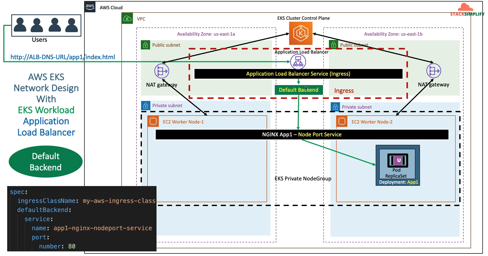
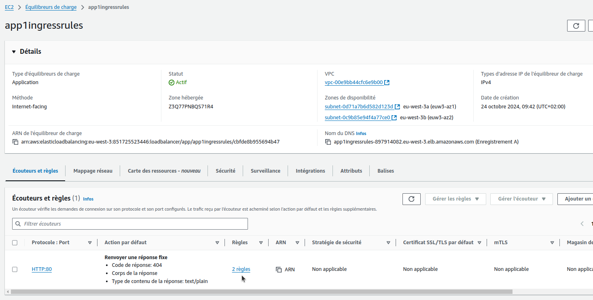
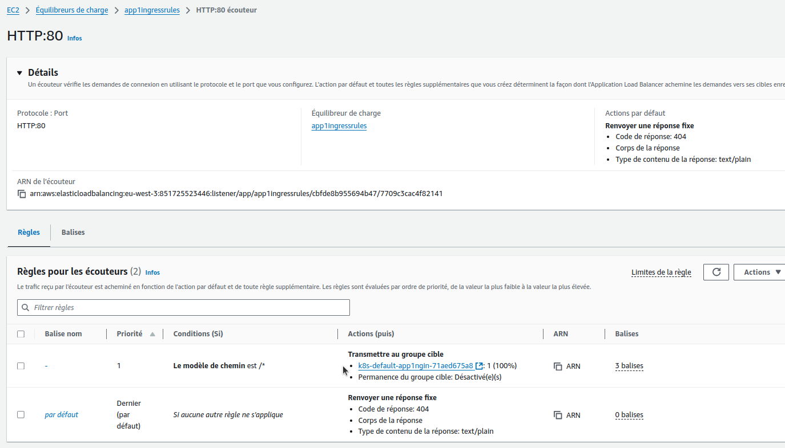

## Step-01: Introduction
- Discuss about the Application Architecture which we are going to deploy
- Understand the following Ingress Concepts
  - [Annotations](https://kubernetes-sigs.github.io/aws-load-balancer-controller/latest/guide/ingress/annotations/)
  - [ingressClassName](https://kubernetes-sigs.github.io/aws-load-balancer-controller/latest/guide/ingress/ingress_class/)
  - [How it works](https://kubernetes-sigs.github.io/aws-load-balancer-controller/latest/how-it-works/)
  - defaultBackend
  - rules





## Step-02: Review App1 Deployment kube-manifest
- **File Location:** `01-kube-manifests-default-backend/01-Nginx-App1-Deployment-and-NodePortService.yml`
```yaml
apiVersion: apps/v1
kind: Deployment
metadata:
  name: app1-nginx-deployment
  labels:
    app: app1-nginx
spec:
  replicas: 1
  selector:
    matchLabels:
      app: app1-nginx
  template:
    metadata:
      labels:
        app: app1-nginx
    spec:
      containers:
        - name: app1-nginx
          image: stacksimplify/kube-nginxapp1:1.0.0
          ports:
            - containerPort: 80
```
## Step-03: Review App1 NodePort Service
- **File Location:** `01-kube-manifests-default-backend/01-Nginx-App1-Deployment-and-NodePortService.yml`
```yaml
apiVersion: v1
kind: Service
metadata:
  name: app1-nginx-nodeport-service
  labels:
    app: app1-nginx
  annotations:
#Important Note:  Need to add health check path annotations in service level if we are planning to use multiple targets in a load balancer    
#    alb.ingress.kubernetes.io/healthcheck-path: /app1/index.html
spec:
  type: NodePort
  selector:
    app: app1-nginx
  ports:
    - port: 80
      targetPort: 80  
```

## Step-04: Review Ingress kube-manifest with Default Backend Option
- [Annotations](https://kubernetes-sigs.github.io/aws-load-balancer-controller/latest/guide/ingress/annotations/)
- **File Location:** `01-kube-manifests-default-backend/02-ALB-Ingress-Basic.yml`
```yaml
# Annotations Reference: https://kubernetes-sigs.github.io/aws-load-balancer-controller/latest/guide/ingress/annotations/
apiVersion: networking.k8s.io/v1
kind: Ingress
metadata:
  name: ingress-nginxapp1
  labels:
    app: app1-nginx
  annotations:
    #kubernetes.io/ingress.class: "alb" (ANCIENNE NOTATION DE DECLARATION DE CLASS INGRESS - Il est recommandé d'utiliser IngressClassName)
    # Ingress Core Settings
    alb.ingress.kubernetes.io/scheme: internet-facing # Pour obtenir une IP publique (sinon internal pour utilisation interne)
    # Health Check Settings
    alb.ingress.kubernetes.io/healthcheck-protocol: HTTP 
    alb.ingress.kubernetes.io/healthcheck-port: traffic-port
    alb.ingress.kubernetes.io/healthcheck-path: /app1/index.html    
    alb.ingress.kubernetes.io/healthcheck-interval-seconds: '15'
    alb.ingress.kubernetes.io/healthcheck-timeout-seconds: '5'
    alb.ingress.kubernetes.io/success-codes: '200'
    alb.ingress.kubernetes.io/healthy-threshold-count: '2'
    alb.ingress.kubernetes.io/unhealthy-threshold-count: '2'
spec:
  ingressClassName: my-aws-ingress-class # (peut être omis car c'est la classe par défaut - is-default-class:true)
  defaultBackend: # Déclaration d'un backend par defaut
    service:
      name: app1-nginx-nodeport-service # Déclaré dans 01-Nginx-App1-Deployment-and-NodePortService.yml
      port:
        number: 80                    
```

- Pour la déclaration de l'ingressClass dépréciée dans les annotations : https://kubernetes-sigs.github.io/aws-load-balancer-controller/v2.3/guide/ingress/ingress_class/#deprecated-kubernetesioingressclass-annotation

## Step-05: Deploy kube-manifests and Verify
```t
# Change Directory
$ cd 08-02-ALB-Ingress-Basics

# Deploy kube-manifests
$ kubectl apply -f 01-kube-manifests-default-backend/
ingressclass.networking.k8s.io/my-aws-ingress-class unchanged
deployment.apps/app1-nginx-deployment created
service/app1-nginx-nodeport-service created
ingress.networking.k8s.io/ingress-nginxapp1 created

# Verify k8s Deployment and Pods
$ kubectl get deploy
NAME                    READY   UP-TO-DATE   AVAILABLE   AGE
app1-nginx-deployment   1/1     1            1           22s

$ kubectl get pods
NAME                                    READY   STATUS    RESTARTS   AGE
app1-nginx-deployment-6b6fc7d6c-xbtz5   1/1     Running   0          33s

# Verify Ingress (Make a note of Address field)
$ kubectl get ingress
NAME                CLASS                  HOSTS   ADDRESS                                             PORTS   AGE
ingress-nginxapp1   my-aws-ingress-class   *       app1ingress-248770322.eu-west-3.elb.amazonaws.com   80      52s

Obsevation: 
1. Verify the ADDRESS value, we should see something like "app1ingress-248770322.eu-west-3.elb.amazonaws.com"

# Describe Ingress Controller
$ kubectl describe ingress ingress-nginxapp1
Name:             ingress-nginxapp1
Labels:           app=app1-nginx
Namespace:        default
Address:          app1ingress-248770322.eu-west-3.elb.amazonaws.com
Ingress Class:    my-aws-ingress-class
Default backend:  app1-nginx-nodeport-service:80 (192.168.111.134:80)
Rules:
  Host        Path  Backends
  ----        ----  --------
  *           *     app1-nginx-nodeport-service:80 (192.168.111.134:80)
Annotations:  alb.ingress.kubernetes.io/healthcheck-interval-seconds: 15
              alb.ingress.kubernetes.io/healthcheck-path: /app1/index.html
              alb.ingress.kubernetes.io/healthcheck-port: traffic-port
              alb.ingress.kubernetes.io/healthcheck-protocol: HTTP
              alb.ingress.kubernetes.io/healthcheck-timeout-seconds: 5
              alb.ingress.kubernetes.io/healthy-threshold-count: 2
              alb.ingress.kubernetes.io/load-balancer-name: app1ingress
              alb.ingress.kubernetes.io/scheme: internet-facing
              alb.ingress.kubernetes.io/success-codes: 200
              alb.ingress.kubernetes.io/unhealthy-threshold-count: 2
Events:
  Type    Reason                  Age   From     Message
  ----    ------                  ----  ----     -------
  Normal  SuccessfullyReconciled  5m4s  ingress  Successfully reconciled


Observation:
1. Review Default Backend and Rules

# List Services
$ kubectl get svc

# Verify Application Load Balancer using 
Goto AWS Mgmt Console -> Services -> EC2 -> Load Balancers
1. Verify Listeners and Rules inside a listener
2. Verify Target Groups
```

Dans la console AWS EC2 > Equilibreurs de charge, on peut voir le Application LB  :


La liaison avec le Target Group :


Le Target Group :


La surveillance :


***Note:*** Il n'y a pas d'Elastic IP liée, celle qu'on peut voir est celle du NAT ...

```t
# Access App using Browser
$ kubectl get ingress
NAME                CLASS                  HOSTS   ADDRESS                                             PORTS   AGE
ingress-nginxapp1   my-aws-ingress-class   *       app1ingress-248770322.eu-west-3.elb.amazonaws.com   80      9m42s

# Tests
http://<ALB-DNS-URL>
http://<ALB-DNS-URL>/app1/index.html
or
http://<INGRESS-ADDRESS-FIELD>
http://<INGRESS-ADDRESS-FIELD>/app1/index.html

# Exemples et résultats
http://app1ingress-248770322.eu-west-3.elb.amazonaws.com

=> **Welcome to nginx!**

http://app1ingress-248770322.eu-west-3.elb.amazonaws.com/app1/index.html

=> **Welcome to Stack Simplify - Application Name: App1**

# Verify AWS Load Balancer Controller logs (à la recherche d'eventuelles erreurs)
$ kubectl get pods -n kube-system 
aws-load-balancer-controller-8649df4674-7qzw2   1/1     Running   0          141m
aws-load-balancer-controller-8649df4674-lgmnw   1/1     Running   0          141m
...

## POD1 Logs: 
kubectl -n kube-system logs -f <POD1-NAME>
kubectl -n kube-system logs -f aws-load-balancer-controller-8649df4674-7qzw2
##POD2 Logs: 
kubectl -n kube-system logs -f <POD2-NAME>
kubectl -n kube-system logs -f aws-load-balancer-controller-8649df4674-lgmnw
```

## Step-06: Clean Up
```t
# Delete Kubernetes Resources
kubectl delete -f 01-kube-manifests-default-backend/
ingressclass.networking.k8s.io "my-aws-ingress-class" deleted
deployment.apps "app1-nginx-deployment" deleted
service "app1-nginx-nodeport-service" deleted
ingress.networking.k8s.io "ingress-nginxapp1" deleted
```

## Step-07: Review Ingress kube-manifest with Ingress Rules
- Discuss about [Ingress Path Types](https://kubernetes.io/docs/concepts/services-networking/ingress/#path-types)
- [Better Path Matching With Path Types](https://kubernetes.io/blog/2020/04/02/improvements-to-the-ingress-api-in-kubernetes-1.18/#better-path-matching-with-path-types)

  - **ImplementationSpecific (par défaut)** : Avec ce type de chemin, la correspondance dépend du contrôleur implémentant l'IngressClass. Les implémentations peuvent traiter cela comme un type de chemin distinct ou de manière identique aux types de chemin Prefix ou Exact.
  - **Exact** : Correspond exactement au chemin URL avec sensibilité à la casse.
  - **Prefix** : Correspondance basée sur un préfixe de chemin URL, séparé par des /. La correspondance est sensible à la casse et se fait élément par élément sur le chemin.

- [Sample Ingress Rule](https://kubernetes.io/docs/concepts/services-networking/ingress/#the-ingress-resource)


- **File Location:** `02-kube-manifests-rules\02-ALB-Ingress-Basic.yml`
```yaml
# Annotations Reference: https://kubernetes-sigs.github.io/aws-load-balancer-controller/latest/guide/ingress/annotations/
apiVersion: networking.k8s.io/v1
kind: Ingress
metadata:
  name: ingress-nginxapp1
  labels:
    app: app1-nginx
  annotations:
    # Load Balancer Name
    alb.ingress.kubernetes.io/load-balancer-name: app1ingressrules
    #kubernetes.io/ingress.class: "alb" (OLD INGRESS CLASS NOTATION - STILL WORKS BUT RECOMMENDED TO USE IngressClass Resource)
    # Ingress Core Settings
    alb.ingress.kubernetes.io/scheme: internet-facing
    # Health Check Settings
    alb.ingress.kubernetes.io/healthcheck-protocol: HTTP 
    alb.ingress.kubernetes.io/healthcheck-port: traffic-port
    alb.ingress.kubernetes.io/healthcheck-path: /app1/index.html    
    alb.ingress.kubernetes.io/healthcheck-interval-seconds: '15'
    alb.ingress.kubernetes.io/healthcheck-timeout-seconds: '5'
    alb.ingress.kubernetes.io/success-codes: '200'
    alb.ingress.kubernetes.io/healthy-threshold-count: '2'
    alb.ingress.kubernetes.io/unhealthy-threshold-count: '2'
spec:
  ingressClassName: my-aws-ingress-class # Ingress Class
  rules:
    - http:
        paths:
          - path: /
            pathType: Prefix
            backend:
              service:
                name: app1-nginx-nodeport-service
                port: 
                  number: 80
      

# 1. If  "spec.ingressClassName: my-aws-ingress-class" not specified, will reference default ingress class on this kubernetes cluster
# 2. Default Ingress class is nothing but for which ingress class we have the annotation `ingressclass.kubernetes.io/is-default-class: "true"`
```

Avec cette configuration, tout le trafic dont l'URL commence par / (/, /app1, /home, etc) sera redirigé vers le service app1-nginx-nodeport-service sur le port 80.


## Step-08: Deploy kube-manifests and Verify
```t
# Change Directory
$ cd 08-02-ALB-Ingress-Basics

# Deploy kube-manifests
$ kubectl apply -f 02-kube-manifests-rules/

# Verify k8s Deployment and Pods
$ kubectl get deploy
NAME                    READY   UP-TO-DATE   AVAILABLE   AGE
app1-nginx-deployment   1/1     1            1           4m55s

$ kubectl get pods
NAME                                    READY   STATUS    RESTARTS   AGE
app1-nginx-deployment-6b6fc7d6c-th6zg   1/1     Running   0          5m8s

# Verify Ingress (Make a note of Address field)
$ kubectl get ingress
NAME                CLASS                  HOSTS   ADDRESS                                                  PORTS   AGE
ingress-nginxapp1   my-aws-ingress-class   *       app1ingressrules-897914082.eu-west-3.elb.amazonaws.com   80      4m

Obsevation: 
1. Verify the ADDRESS value, we should see something like "app1ingressrules-897914082.eu-west-3.elb.amazonaws.com"
```

```yml
# Describe Ingress Controller
$ kubectl describe ingress ingress-nginxapp1
Name:             ingress-nginxapp1
Labels:           app=app1-nginx
Namespace:        default
Address:          app1ingressrules-897914082.eu-west-3.elb.amazonaws.com
Ingress Class:    my-aws-ingress-class
Default backend:  <default>
Rules:
  Host        Path  Backends
  ----        ----  --------
  *           
              /   app1-nginx-nodeport-service:80 (192.168.120.242:80)
Annotations:  alb.ingress.kubernetes.io/healthcheck-interval-seconds: 15
              alb.ingress.kubernetes.io/healthcheck-path: /app1/index.html
              alb.ingress.kubernetes.io/healthcheck-port: traffic-port
              alb.ingress.kubernetes.io/healthcheck-protocol: HTTP
              alb.ingress.kubernetes.io/healthcheck-timeout-seconds: 5
              alb.ingress.kubernetes.io/healthy-threshold-count: 2
              alb.ingress.kubernetes.io/load-balancer-name: app1ingressrules
              alb.ingress.kubernetes.io/scheme: internet-facing
              alb.ingress.kubernetes.io/success-codes: 200
              alb.ingress.kubernetes.io/unhealthy-threshold-count: 2
Events:
  Type    Reason                  Age    From     Message
  ----    ------                  ----   ----     -------
  Normal  SuccessfullyReconciled  4m36s  ingress  Successfully reconciled


Observation:
1. Review Default Backend and Rules
```


```t
# List Services
$ kubectl get svc
NAME                          TYPE        CLUSTER-IP      EXTERNAL-IP   PORT(S)        AGE
app1-nginx-nodeport-service   NodePort    10.100.167.82   <none>        80:30799/TCP   28m
kubernetes                    ClusterIP   10.100.0.1      <none>        443/TCP        3h57m

# Verify Application Load Balancer using 
Goto AWS Mgmt Console -> Services -> EC2 -> Load Balancers
1. Verify Listeners and Rules inside a listener
2. Verify Target Groups
```

On peut voir le LB de type Application :


Dans l'onglet **Ecouteurs et règles**, on clique sur les règles



On peut voir les règles pour l'écouteur HTTP/80 et notamment pour la règle /, on envoie vers un **Target Group** :



Et on voit le Target Group concerné :


```t
# Access App using Browser
$ kubectl get ingress
NAME                CLASS                  HOSTS   ADDRESS                                                  PORTS   AGE
ingress-nginxapp1   my-aws-ingress-class   *       app1ingressrules-897914082.eu-west-3.elb.amazonaws.com   80      27m

http://<ALB-DNS-URL>
http://<ALB-DNS-URL>/app1/index.html
or
http://<INGRESS-ADDRESS-FIELD>
http://<INGRESS-ADDRESS-FIELD>/app1/index.html
```

Exemple :

```
http://app1ingressrules-897914082.eu-west-3.elb.amazonaws.com
```

=> Welcome to nginx!

```
http://app1ingressrules-897914082.eu-west-3.elb.amazonaws.com/app1/index.html
```
=> Welcome to Stack Simplify - Application Name: App1

```
http://app1ingressrules-897914082.eu-west-3.elb.amazonaws.com/app4/index.html
```
=> 404 - Not found - Normal, pas de default backend !

```t
# Verify AWS Load Balancer Controller logs
$ kubectl get po -n kube-system 
NAME                                            READY   STATUS    RESTARTS   AGE
aws-load-balancer-controller-8649df4674-7qzw2   1/1     Running   0          3h24m
aws-load-balancer-controller-8649df4674-lgmnw   1/1     Running   0          3h24m
...

$ kubectl logs -f aws-load-balancer-controller-8649df4674-7qzw2 -n kube-system
```

## Step-09: Clean Up
```t
# Delete Kubernetes Resources
$ kubectl delete -f 02-kube-manifests-rules/
```
Notes : 
- Cette commande ne me rendait pas la main car ca bloquait eu niveau de _ingress.networking.k8s.io "ingress-nginxapp1" deleted_
- Je l'ai interrompu avec ^C et je ne voyais plus de LB dans la console AWS
- Mais j'avais toujours quelque chose avec _kubectl get ingress_
- Ca devait bloquer car l'IngressClass avait déjà été effacée (je l'ai rajouté dans les manifestes)

Supprimer en 1ier l'ingress :

```t
# Delete Ingress first
$ kubectl delete ingress ingress-nginxapp1

# Delete Kubernetes Other Resources
$ kubectl delete -f 02-kube-manifests-rules/
```

Autre piste si bloqué : supprimer les finalizers 

```t
# Voir s'il y a une section Finalizers
$ kubectl get ingress ingress-nginxapp1 -o yaml

# Editer le configuration et supprimer la section Finalizers
$ kubectl edit ingress ingress-nginxapp1
```

On peut aussi forcer la suppression de l'Ingress (non testé) :

```t
kubectl delete ingress ingress-nginxapp1 --grace-period=0 --force
```

```t
# Verify if Ingress Deleted successfully 
$ kubectl get ingress
No resources found in default namespace.
```
**Note importante : Laisser un équilibreur de charge ALB inactif sans le supprimer correctement peut entraîner des coûts élevés.**

```t
# Verify Application Load Balancer DELETED 
Goto AWS Mgmt Console -> Services -> EC2 -> Load Balancers
```


