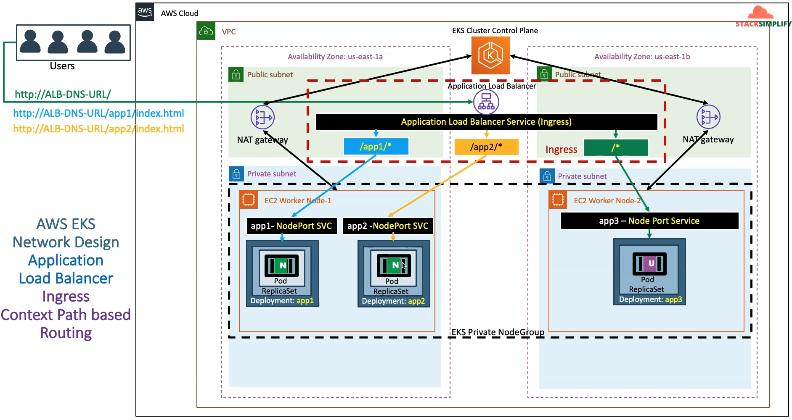
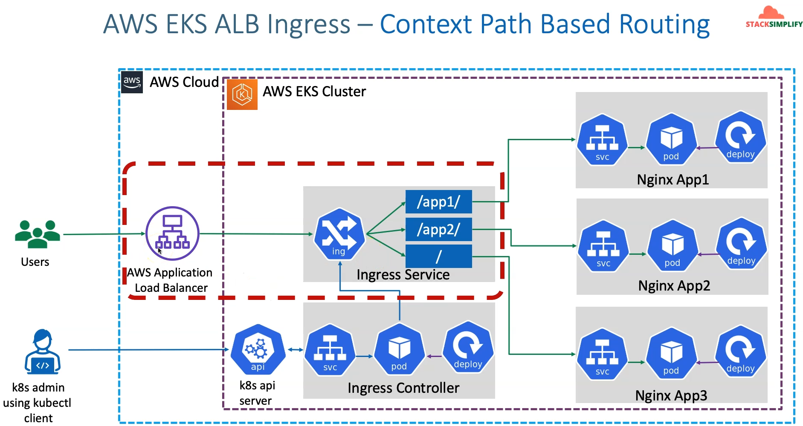
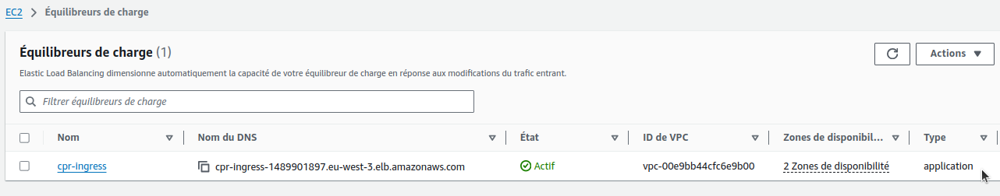
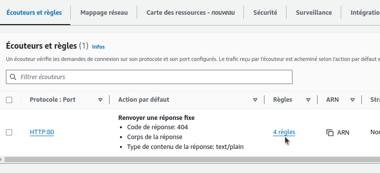
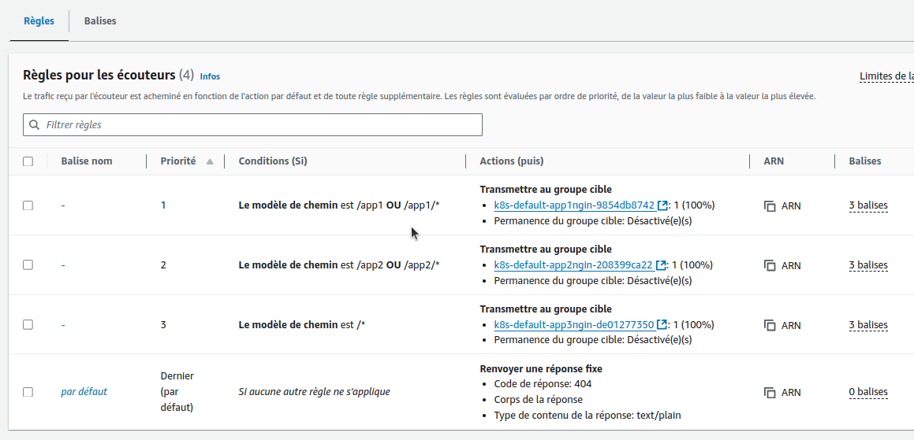
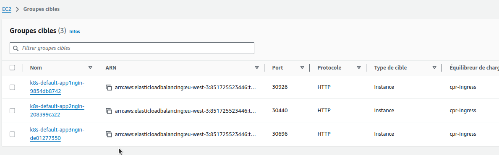

## Step-01: Introduction
- Discuss about the Architecture we are going to build as part of this Section
- We are going to deploy all these 3 apps in kubernetes with context path based routing enabled in Ingress Controller
  - /app1/* - should go to app1-nginx-nodeport-service
  - /app2/* - should go to app1-nginx-nodeport-service
  - /*    - should go to  app3-nginx-nodeport-service
- As part of this process, this respective annotation `alb.ingress.kubernetes.io/healthcheck-path:` will be moved to respective application NodePort Service. 
- Only generic settings will be present in Ingress manifest annotations area `04-ALB-Ingress-ContextPath-Based-Routing.yml`  



En fait l'AWS Application LB et l'Ingress Service sont un même objet (il n'y a pas de proxy entre les 2 par exemple) ... il est appelé Ingress Service depuis Kubernetes et Application LB depuis AWS.




## Step-02: Review Nginx App1, App2 & App3 Deployment & Service
- Differences for all 3 apps will be only two fields from kubernetes manifests perspective and their naming conventions
  - **Kubernetes Deployment:** Container Image name
  - **Kubernetes Node Port Service:** Health check URL path 
- **App1 Nginx: 01-Nginx-App1-Deployment-and-NodePortService.yml**
  - **image:** stacksimplify/kube-nginxapp1:1.0.0
  - **Annotation:** alb.ingress.kubernetes.io/healthcheck-path: /app1/index.html
- **App2 Nginx: 02-Nginx-App2-Deployment-and-NodePortService.yml**
  - **image:** stacksimplify/kube-nginxapp2:1.0.0
  - **Annotation:** alb.ingress.kubernetes.io/healthcheck-path: /app2/index.html
- **App3 Nginx: 03-Nginx-App3-Deployment-and-NodePortService.yml**
  - **image:** stacksimplify/kubenginx:1.0.0
  - **Annotation:** alb.ingress.kubernetes.io/healthcheck-path: /index.html

Exemple avec 02-Nginx-App2-Deployment-and-NodePortService.yml :

```yml
apiVersion: apps/v1
kind: Deployment
metadata:
  name: app2-nginx-deployment
  labels:
    app: app2-nginx 
spec:
  replicas: 1
  selector:
    matchLabels:
      app: app2-nginx
  template:
    metadata:
      labels:
        app: app2-nginx
    spec:
      containers:
        - name: app2-nginx
          image: stacksimplify/kube-nginxapp2:1.0.0
          ports:
            - containerPort: 80
---
apiVersion: v1
kind: Service
metadata:
  name: app2-nginx-nodeport-service
  labels:
    app: app2-nginx
  annotations:
    # Important Note:  Need to add health check path annotations in service level if we are planning to use multiple targets in a load balancer
    alb.ingress.kubernetes.io/healthcheck-path: /app2/index.html
spec:
  type: NodePort
  selector:
    app: app2-nginx
  ports:
    - port: 80
      targetPort: 80
```

## Step-03: Create ALB Ingress Context path based Routing Kubernetes manifest
- **04-ALB-Ingress-ContextPath-Based-Routing.yml**
```yaml
# Annotations Reference: https://kubernetes-sigs.github.io/aws-load-balancer-controller/latest/guide/ingress/annotations/
apiVersion: networking.k8s.io/v1
kind: Ingress
metadata:
  name: ingress-cpr-demo
  annotations:
    # Load Balancer Name
    alb.ingress.kubernetes.io/load-balancer-name: cpr-ingress
    # Ingress Core Settings
    #kubernetes.io/ingress.class: "alb" (OLD INGRESS CLASS NOTATION - STILL WORKS BUT RECOMMENDED TO USE IngressClass Resource)
    alb.ingress.kubernetes.io/scheme: internet-facing
    # Health Check Settings
    alb.ingress.kubernetes.io/healthcheck-protocol: HTTP 
    alb.ingress.kubernetes.io/healthcheck-port: traffic-port
    #Important Note:  Need to add health check path annotations in service level if we are planning to use multiple targets in a load balancer    
    alb.ingress.kubernetes.io/healthcheck-interval-seconds: '15'
    alb.ingress.kubernetes.io/healthcheck-timeout-seconds: '5'
    alb.ingress.kubernetes.io/success-codes: '200'
    alb.ingress.kubernetes.io/healthy-threshold-count: '2'
    alb.ingress.kubernetes.io/unhealthy-threshold-count: '2'   
spec:
  ingressClassName: my-aws-ingress-class   # Ingress Class                  
  rules:
    - http:
        paths:      
          - path: /app1
            pathType: Prefix
            backend:
              service:
                name: app1-nginx-nodeport-service
                port: 
                  number: 80
          - path: /app2
            pathType: Prefix
            backend:
              service:
                name: app2-nginx-nodeport-service
                port: 
                  number: 80
          - path: /
            pathType: Prefix
            backend:
              service:
                name: app3-nginx-nodeport-service
                port: 
                  number: 80              

# Important Note-1: In path based routing order is very important, if we are going to use  "/*", try to use it at the end of all rules.                                        
                        
# 1. If  "spec.ingressClassName: my-aws-ingress-class" not specified, will reference default ingress class on this kubernetes cluster
# 2. Default Ingress class is nothing but for which ingress class we have the annotation `ingressclass.kubernetes.io/is-default-class: "true"`                      
```

## Step-04: Deploy all manifests and test
```t
# Deploy Kubernetes manifests
$ kubectl apply -f kube-manifests/
ingressclass.networking.k8s.io/my-aws-ingress-class created
deployment.apps/app1-nginx-deployment created
service/app1-nginx-nodeport-service created
deployment.apps/app2-nginx-deployment created
service/app2-nginx-nodeport-service created
deployment.apps/app3-nginx-deployment created
service/app3-nginx-nodeport-service created
ingress.networking.k8s.io/ingress-cpr-demo created

# List Pods
$ kubectl get pods
NAME                                     READY   STATUS    RESTARTS   AGE
app1-nginx-deployment-6b6fc7d6c-29wwm    1/1     Running   0          43s
app2-nginx-deployment-659d547974-wnpwg   1/1     Running   0          43s
app3-nginx-deployment-5b57495d56-7z5pv   1/1     Running   0          43s

# List Services
$ kubectl get svc
NAME                          TYPE        CLUSTER-IP       EXTERNAL-IP   PORT(S)        AGE
app1-nginx-nodeport-service   NodePort    10.100.28.198    <none>        80:30926/TCP   76s
app2-nginx-nodeport-service   NodePort    10.100.123.165   <none>        80:30440/TCP   76s
app3-nginx-nodeport-service   NodePort    10.100.159.26    <none>        80:30696/TCP   76s
kubernetes                    ClusterIP   10.100.0.1       <none>        443/TCP        4h43m

# List Ingress Load Balancers
$ kubectl get ingress
NAME               CLASS                  HOSTS   ADDRESS                                              PORTS   AGE
ingress-cpr-demo   my-aws-ingress-class   *       cpr-ingress-1489901897.eu-west-3.elb.amazonaws.com   80      101s

# Describe Ingress and view Rules
$ kubectl describe ingress ingress-cpr-demo
Name:             ingress-cpr-demo
Labels:           <none>
Namespace:        default
Address:          cpr-ingress-1489901897.eu-west-3.elb.amazonaws.com
Ingress Class:    my-aws-ingress-class
Default backend:  <default>
Rules:
  Host        Path  Backends
  ----        ----  --------
  *           
              /app1   app1-nginx-nodeport-service:80 (192.168.110.118:80)
              /app2   app2-nginx-nodeport-service:80 (192.168.111.134:80)
              /       app3-nginx-nodeport-service:80 (192.168.73.238:80)
Annotations:  alb.ingress.kubernetes.io/healthcheck-interval-seconds: 15
              alb.ingress.kubernetes.io/healthcheck-port: traffic-port
              alb.ingress.kubernetes.io/healthcheck-protocol: HTTP
              alb.ingress.kubernetes.io/healthcheck-timeout-seconds: 5
              alb.ingress.kubernetes.io/healthy-threshold-count: 2
              alb.ingress.kubernetes.io/load-balancer-name: cpr-ingress
              alb.ingress.kubernetes.io/scheme: internet-facing
              alb.ingress.kubernetes.io/success-codes: 200
              alb.ingress.kubernetes.io/unhealthy-threshold-count: 2
Events:
  Type    Reason                  Age    From     Message
  ----    ------                  ----   ----     -------
  Normal  SuccessfullyReconciled  2m37s  ingress  Successfully reconciled

# Verify AWS Load Balancer Controller logs (looking for some errors)
$ kubectl -n kube-system  get pods 

$ kubectl -n kube-system logs -f aws-load-balancer-controller-794b7844dd-8hk7n 
```

## Step-05: Verify Application Load Balancer on AWS Management Console**
- Verify Load Balancer
    - In Listeners Tab, click on **View/Edit Rules** under Rules
- Verify Target Groups
    - GroupD Details
    - Targets: Ensure they are healthy
    - Verify Health check path
    - Verify all 3 targets are healthy)








```t
# Access Application
http://<ALB-DNS-URL>/app1/index.html
http://<ALB-DNS-URL>/app2/index.html
http://<ALB-DNS-URL>/
```

## Step-06: Test Order in Context path based routing
### Step-0-01: Move Root Context Path to top
- **File:** 04-ALB-Ingress-ContextPath-Based-Routing.yml
```yaml
  ingressClassName: my-aws-ingress-class   # Ingress Class                  
  rules:
    - http:
        paths:      
          - path: /
            pathType: Prefix
            backend:
              service:
                name: app3-nginx-nodeport-service
                port: 
                  number: 80           
          - path: /app1
            pathType: Prefix
            backend:
              service:
                name: app1-nginx-nodeport-service
                port: 
                  number: 80
          - path: /app2
            pathType: Prefix
            backend:
              service:
                name: app2-nginx-nodeport-service
                port: 
                  number: 80
```
### Step-06-02: Deploy Changes and Verify
```t
# Deploy Changes
kubectl apply -f kube-manifests/

# Access Application (Open in new incognito window)
http://<ALB-DNS-URL>/app1/index.html  -- SHOULD FAIL
http://<ALB-DNS-URL>/app2/index.html  -- SHOULD FAIL
http://<ALB-DNS-URL>/  - SHOULD PASS
```

## Step-07: Roll back changes in 04-ALB-Ingress-ContextPath-Based-Routing.yml
```yaml
spec:
  ingressClassName: my-aws-ingress-class   # Ingress Class                  
  rules:
    - http:
        paths:      
          - path: /app1
            pathType: Prefix
            backend:
              service:
                name: app1-nginx-nodeport-service
                port: 
                  number: 80
          - path: /app2
            pathType: Prefix
            backend:
              service:
                name: app2-nginx-nodeport-service
                port: 
                  number: 80
          - path: /
            pathType: Prefix
            backend:
              service:
                name: app3-nginx-nodeport-service
                port: 
                  number: 80              
```

## Step-08: Clean Up
```t
# Clean-Up
kubectl delete -f kube-manifests/
```
