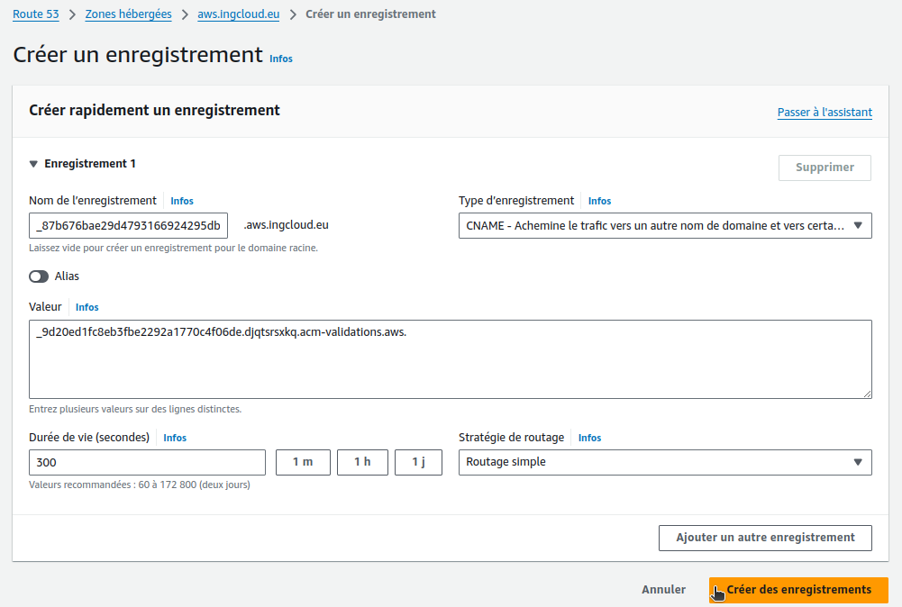

## Step-01: Introduction
- We are going to register a new DNS in AWS Route53
- We are going to create a SSL certificate 
- Add Annotations related to SSL Certificate in Ingress manifest
- Deploy the manifests and test
- Clean-Up

## Step-02: Pre-requisite - Register a Domain in Route53 (if not exists)
- Goto Services -> Route53 -> Registered Domains
- Click on **Register Domain**
- Provide **desired domain: somedomain.com** and click on **check** (In my case its going to be `stacksimplify.com`)
- Click on **Add to cart** and click on **Continue**
- Provide your **Contact Details** and click on **Continue**
- Enable Automatic Renewal
- Accept **Terms and Conditions**
- Click on **Complete Order**

On peut enregistrer un sous domaine dans Route53 > Zone hébergée > Ajouter : aws.ingcloud.eu (le domaine est chez godaddy.com)


On obtient les NS :


On fait des NS dans le Registar (godaddy.com) avec les NS que fournis AWS pour la zone :


## Step-03: Create a SSL Certificate in Certificate Manager
- Pre-requisite: You should have a registered domain in Route53 
- Go to Services -> Certificate Manager -> Create a Certificate
- Click on **Request a Certificate**
  - Choose the type of certificate for ACM to provide: Request a public certificate
  - Add domain names: *.yourdomain.com (in my case it is going to be `*.stacksimplify.com`)
  - Select a Validation Method: **DNS Validation**
  - Click on **Confirm & Request**    
- **Validation**
  - Click on **Create record in Route 53**  
- Wait for 5 to 10 minutes and check the **Validation Status**  


On crée une demande de certificat public pour *.aws.ingcloud.eu (on veut utilser un sous domaine) :


On obtient les infos à mettre dans son registar :


On ajoute le CNAME dans Route53 (puisque c'est Route53 qui gère le sous domaine aws.ingcloud.eu) :



On teste :

```
$ host _87b676bae29d4793166924295dbc5173.aws.ingcloud.eu
_87b676bae29d4793166924295dbc5173.aws.ingcloud.eu is an alias for _9d20ed1fc8eb3fbe2292a1770c4f06de.djqtsrsxkq.acm-validations.aws.
```

Au bout de 15 à 20 min le certificat est émis :


On récupère l'arn du certificat : 


- arn:aws:acm:eu-west-3:851725523446:certificate/b984611e-e641-48f7-9462-3d15af0b20f1

## Step-04: Add annotations related to SSL
- **04-ALB-Ingress-SSL.yml**

On met l'ARN du certifcat dans les annotations de l'ingress :

```yaml
    ## SSL Settings
    alb.ingress.kubernetes.io/listen-ports: '[{"HTTPS":443}, {"HTTP":80}]'
    alb.ingress.kubernetes.io/certificate-arn: arn:aws:acm:eu-west-3:851725523446:certificate/b984611e-e641-48f7-9462-3d15af0b20f1
    #alb.ingress.kubernetes.io/ssl-policy: ELBSecurityPolicy-TLS-1-1-2017-01 #Optional (Picks default if not used)    
```
## Step-05: Deploy all manifests and test
### Deploy and Verify
```t
# Deploy kube-manifests
$ kubectl apply -f kube-manifests/
ingressclass.networking.k8s.io/my-aws-ingress-class created
deployment.apps/app1-nginx-deployment created
service/app1-nginx-nodeport-service created
deployment.apps/app2-nginx-deployment created
service/app2-nginx-nodeport-service created
deployment.apps/app3-nginx-deployment created
service/app3-nginx-nodeport-service created
ingress.networking.k8s.io/ingress-ssl-demo created

# Verify Ingress Resource
$ kubectl get ingress
NAME               CLASS                  HOSTS   ADDRESS                                             PORTS   AGE
ingress-ssl-demo   my-aws-ingress-class   *       ssl-ingress-606772891.eu-west-3.elb.amazonaws.com   80      33s

# Verify Ingress Resource details
$ kubectl describe ingress ingress-ssl-demo
Name:             ingress-ssl-demo
Labels:           <none>
Namespace:        default
Address:          ssl-ingress-606772891.eu-west-3.elb.amazonaws.com
Ingress Class:    my-aws-ingress-class
Default backend:  app3-nginx-nodeport-service:80 (192.168.123.65:80)
Rules:
  Host        Path  Backends
  ----        ----  --------
  *           
              /app1   app1-nginx-nodeport-service:80 (192.168.64.88:80)
              /app2   app2-nginx-nodeport-service:80 (192.168.81.111:80)
Annotations:  alb.ingress.kubernetes.io/certificate-arn: arn:aws:acm:eu-west-3:851725523446:certificate/a3554dca-d446-4493-a1a7-953fb7a694ec
              alb.ingress.kubernetes.io/healthcheck-interval-seconds: 15
              alb.ingress.kubernetes.io/healthcheck-port: traffic-port
              alb.ingress.kubernetes.io/healthcheck-protocol: HTTP
              alb.ingress.kubernetes.io/healthcheck-timeout-seconds: 5
              alb.ingress.kubernetes.io/healthy-threshold-count: 2
              alb.ingress.kubernetes.io/listen-ports: [{"HTTPS":443}, {"HTTP":80}]
              alb.ingress.kubernetes.io/load-balancer-name: ssl-ingress
              alb.ingress.kubernetes.io/scheme: internet-facing
              alb.ingress.kubernetes.io/success-codes: 200
              alb.ingress.kubernetes.io/unhealthy-threshold-count: 2
Events:
  Type    Reason                  Age    From     Message
  ----    ------                  ----   ----     -------
  Normal  SuccessfullyReconciled  3m16s  ingress  Successfully reconciled
```
On vérifie les pods de l'aplication :

```t
# Verify Apps
$ kubectl get deploy
NAME                    READY   UP-TO-DATE   AVAILABLE   AGE
app1-nginx-deployment   1/1     1            1           58s
app2-nginx-deployment   1/1     1            1           58s
app3-nginx-deployment   1/1     1            1           58s

$ kubectl get pods
NAME                                     READY   STATUS    RESTARTS   AGE
app1-nginx-deployment-6b6fc7d6c-btq92    1/1     Running   0          74s
app2-nginx-deployment-659d547974-cdt7r   1/1     Running   0          74s
app3-nginx-deployment-68c56f95f7-pgsc6   1/1     Running   0          74s

# Verify NodePort Services
kubectl get svc
NAME                          TYPE        CLUSTER-IP       EXTERNAL-IP   PORT(S)        AGE
app1-nginx-nodeport-service   NodePort    10.100.193.11    <none>        80:32509/TCP   88s
app2-nginx-nodeport-service   NodePort    10.100.193.229   <none>        80:30527/TCP   88s
app3-nginx-nodeport-service   NodePort    10.100.221.101   <none>        80:31911/TCP   88s
kubernetes                    ClusterIP   10.100.0.1       <none>        443/TCP        144m
```
### Verify Load Balancer & Target Groups
- Load Balancer -  Listeneres (Verify both 80 & 443) 
- Load Balancer - Rules (Verify both 80 & 443 listeners) 
- Target Groups - Group Details (Verify Health check path)
- Target Groups - Targets (Verify all 3 targets are healthy)

l'ALB crée :


Les règles pour les 2 listeners (http/80 et https/443)


Le target group pour le listener https/443 :


## Step-06: Add DNS in Route53   
- Go to **Services -> Route 53**
- Go to **Hosted Zones**
  - Click on **yourdomain.com** (aws.ingcloud.eu)
- Create a **Record Set**
  - **Name:** my-app-test
  - **Alias:** yes
  - **Alias Target:** Copy our ALB DNS Name here (Sample: ssl-ingress-551932098.us-east-1.elb.amazonaws.com)
  - Click on **Create**

On ajoute my-app-test dans la zone hébergée aws.ingcloud.eu en CNAME avec l'adresse du LB ssl-ingress-606772891.eu-west-3.elb.amazonaws.com (avec TTL très court de 60s pour les tests):


## Step-07: Access Application using newly registered DNS Name
- **Access Application**
- **Important Note:** Instead of `stacksimplify.com` you need to replace with your registered Route53 domain (Refer pre-requisite Step-02)
```
# HTTP URLs
http://my-app-test.aws.ingcloud.eu/app1/index.html
http://my-app-test.aws.ingcloud.eu/app2/index.html
http://my-app-test.aws.ingcloud.eu

# HTTPS URLs
https://my-app-test.aws.ingcloud.eu/app1/index.html
https://my-app-test.aws.ingcloud.eu/app2/index.html
https://my-app-test.aws.ingcloud.eu
```

## Annotation Reference
- [AWS Load Balancer Controller Annotation Reference](https://kubernetes-sigs.github.io/aws-load-balancer-controller/v2.4/guide/ingress/annotations/)