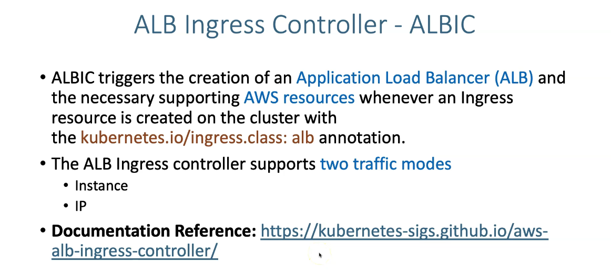

# Load Balancing workloads on EKS using AWS Application Load Balancer

## Topics
- We will be looking in to this topic very extensively in a step by step and module by module model. 
- The below will be the list of topics covered as part of AWS ALB Ingress Perspective. 

| S.No  | Topic Name |
| ------------- | ------------- |
| 1.  | AWS Load Balancer Controller Installation  |
| 2.  | ALB Ingress Basics  |
| 3.  | ALB Ingress Context Path based Routing  |
| 4.  | ALB Ingress SSL  |
| 5.  | ALB Ingress SSL Redirect (HTTP to HTTPS) |
| 6.  | ALB Ingress External DNS |
| 7.  | ALB Ingress External DNS for k8s Ingress |
| 8.  | ALB Ingress External DNS for k8s Service |
| 9.  | ALB Ingress Name based Virtual Host Routing |
| 10. | ALB Ingress SSL Discovery - Host |
| 11. | ALB Ingress SSL Discovery - TLS |
| 12. | ALB Ingress Groups |
| 13. | ALB Ingress Target Type - IP Mode |
| 14. | ALB Ingress Internal Load Balancer |

Dans l'Ingress Controller ALB (AWS Load Balancer Controller), les modes "Instance" et "IP" déterminent la façon dont le trafic est routé du load balancer vers les Pods dans votre cluster Kubernetes. Chaque mode a un fonctionnement et des cas d'utilisation spécifiques. Voici une explication simple :

**1. Instance Mode (Mode Instance)**

- Comment ça fonctionne : Le trafic provenant du load balancer ALB est routé vers les adresses IP des instances EC2 sur lesquelles vos Pods s'exécutent. Le load balancer connaît les instances EC2 qui font partie de votre cluster Kubernetes, et il utilise l'adresse IP des nœuds (instances EC2) comme point de terminaison cible.
- Avantages :
  - Moins de complexité : l'ALB n'a pas besoin de connaître directement les Pods individuels, seulement les instances EC2.
  - Fonctionne bien lorsque vous avez des instances EC2 stables.

- Inconvénients :
  - Ce mode peut nécessiter une configuration de sécurité supplémentaire pour garantir que les instances EC2 peuvent bien router le trafic vers les Pods appropriés.
  - Si plusieurs Pods sont sur la même instance, le routage doit être géré localement par l'instance, via le proxy (ex: kube-proxy).

**2. IP Mode (Mode IP)**

- Comment ça fonctionne : Le trafic provenant du load balancer ALB est directement routé vers les adresses IP des Pods dans votre cluster Kubernetes. L'ALB obtient les adresses IP des Pods à partir des ressources Ingress, et chaque Pod est une cible directe du load balancer.
- Avantages :
  - Réduction de la latence et du trafic de rebond, car le trafic est routé directement vers les Pods sans passer par une autre couche.
  - Meilleure granularité et visibilité sur les cibles de routage.

- Inconvénients :
  - Nécessite une configuration réseau supplémentaire pour autoriser les IP privées des Pods à être accessibles directement depuis le load balancer.
  - Peut nécessiter une attention particulière pour gérer les cycles de vie des Pods (création, suppression).

**Quel mode choisir ?**

  - **Instance Mode** est utile lorsque vos instances EC2 sont stables et lorsque les règles de routage entre les instances et les Pods sont bien gérées au niveau de Kubernetes.

  - **IP Mode** est recommandé lorsque vous avez besoin d'un routage plus direct et que vos règles de sécurité permettent un accès direct aux adresses IP des Pods. Ce mode est également idéal lorsque vous utilisez des clusters EKS gérés ou lorsque vous disposez d'une configuration réseau flexible.
  
En résumé, le choix entre les deux modes dépend de votre infrastructure réseau, de la stabilité des nœuds et de vos exigences de routage de trafic.

AWS Load Balancer Controller est la nouvelle mouture de AWS ALB Ingress Controlleur (déprécié)

## References: 
- Good to refer all the below for additional understanding.

### AWS Load Balancer Controller
- [AWS Load Balancer Controller Documentation](https://kubernetes-sigs.github.io/aws-load-balancer-controller/v2.4/)

### AWS ALB Ingress Annotations Reference
- https://kubernetes-sigs.github.io/aws-load-balancer-controller/v2.4/guide/ingress/annotations/

### eksctl getting started
- https://eksctl.io/introduction/#getting-started

### External DNS
- https://github.com/kubernetes-sigs/external-dns
- https://github.com/kubernetes-sigs/external-dns/blob/master/docs/tutorials/alb-ingress.md
- https://github.com/kubernetes-sigs/external-dns/blob/master/docs/tutorials/aws.md